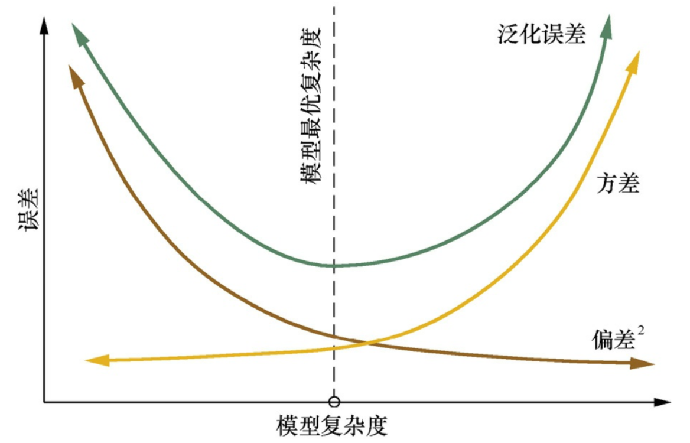
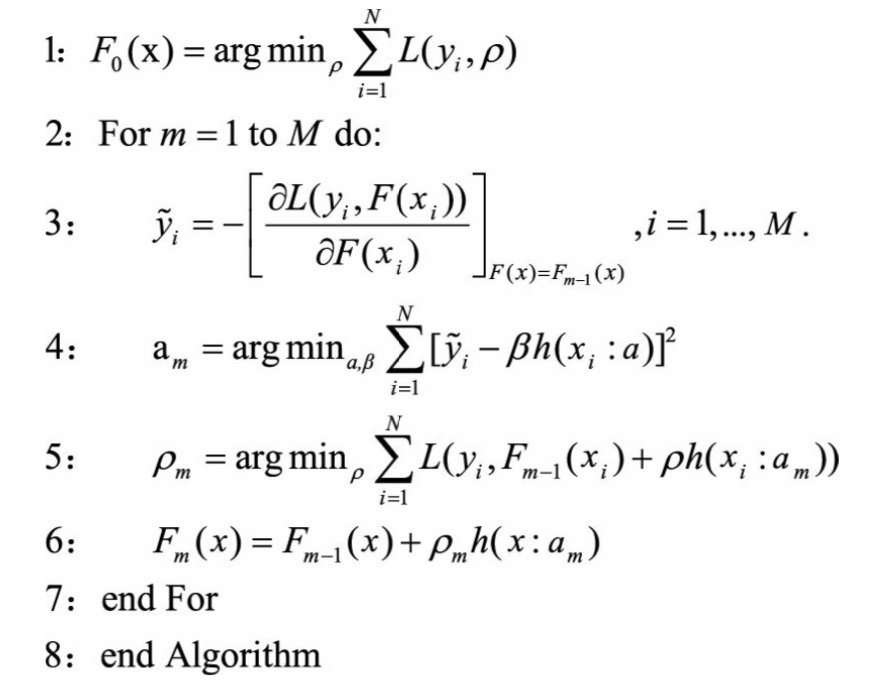

[TOC]

### 1. 集成学习的种类

集成学习的思路主要分类两种 —— **Boosting** 和 **Bagging**.

* **Boosting** 采用串行的方式训练基分类器, 

### 2. 集成学习的具体方法并举例

#### 2.1 Adaboost

#### 2.2 GBDT

### 3. 基分类器

### 4. 偏差和方差

#### 4.2 如何从减小方差和偏差的角度解释Boosting和Bagging的原理?

简单来说, Bagging 从减小方差的方向提高基分类器的性能, 而 Boosting 从减小偏差的角度提高基分类器性能. 

##### 4.2.1 Bagging

Bagging 是Bootstrap Aggregation 的简称, 意思就是再抽样, 然后在每个样本上训练出来的模型在取平均.

假设有$n$个随机变量, 方差记为$\sigma^2$, 两个变量之间的相关性为$p$, 则这$n$个随机变量均值$\frac{\sum X_i}{n}$的方差为$\rho\sigma^2+\frac{(1-\rho)\sigma^2}{n}$. 在随机变量完全独立的情况下, $n$个随机变量的方差为$\frac{\sigma^2}{n}$, 即方差减小到原来的$\frac{1}{n}$. 

从模型的角度去理解, 对$n$个独立不相关的模型的预测结果做平均, 方差是原来模型的$\frac{1}{n}$. 这样的描述不甚严谨,但是原理却表达的很明显. 当然模型也不可能完全独立. 

为了追求模型的独立性, 很多Bagging方法都做了很多改进. 比如随机森林中, 每次选取节点分裂属性时, 会随机抽取一个属性子集, 而不是从所有属性中选取最优属性, 这就是为了避免弱分类器之间存在过强相关性. 通过对训练集的重采样也能够带来弱分类器之间的一定独立性, 从而降低Bagging后的方差.

##### 4.2.2 Boosting

Boosting的方法在之前提过, 基本原理就是训练好一个弱分类器之后, 需要计算这个弱分类器的错误或残差, 作为下一个弱分类器的输入. 这个过程本身就是在不断减小损失函数, 即减小模型的Bias(偏差). 但是Boosting的方法不会显著降低模型的方差, 因为Boosting的训练过程使得各个弱分类器之间是强相关的, 缺乏独立性, 所以不会对降低模型方差有作用.

关于模型复杂度和偏差, 方差与泛化误差如下图所示. 

### 5. 梯度提升决策树

梯度提升决策树(Gradient Boosting Decision Tree)是Boosting算法中非常流行的模型, 在机器学习竞赛和商业应用中都有非常优秀的表现. GBDT非常好的提现了"从错误中学习"的理念, 基于决策树预测的残差迭代地进行学习.

#### 5.1 GBDT的基本原理

Gradient Boosting是Boosting中的一大类算法, 其基本思想是根据当前模型损失函数的负梯度信息来训练新加入的弱分类器, 然后将训练好的弱分类器以累加的形式结合到现有模型中.

如下算法描述了Gradient Boosting算法的基本流程. 在每一轮新的迭代中, 首先计算当前模型在所有样本上的负梯度, 然后以该值为目标去训练新的弱分类器, 并计算该弱分类器的权重, 最终实现对模型的更新.

以决策树为弱分类器的Gradient Boosting算法被称作GBDT, 有时又被称为MART(Multiple Additive Regression Tree). GBDT中的决策树通常为CART.

#### 5.2 梯度提升和梯度下降的区别和联系

对比梯度提升和梯度下降算法, 可以发现

* 两者都是在每一轮迭代过程中, 利用损失函数相对于模型的负梯度方向的信息对模型进行更新;
* 区别在于
  * 梯度下降中, 模型是以参数化的形式表示, 模型更新等价于参数更新;
  * 梯度提升中, 模型不需要参数化表示, 而是直接定义在函数空间中, 从而扩大了可以使用的模型种类.

| 梯度提升     | 函数空间$F$     | $F=F_{t-1}-\rho_t\nabla_F L|_{F=F_{t-1}}$ | $L=\sum l(y_i, F(x_i))$   |
| ------------ | --------------- | ----------------------------------------- | ------------------------- |
| **梯度下降** | **参数空间**$W$ | $W=W_{t-1}-\rho_t\nabla_W L|_{W=W_{t-1}}$ | $L=\sum l(y_i, f_W(x_i))$ |

#### 5.3 GBDT的优点和局限性

**优点:**

* 预测阶段计算速度快, 数和数之间可以并行化
* 在分布稠密的数据集上, 泛化能力和表现能力都很好
* 采用决策树作为弱分类器使得GBDT模型具有较好的解释性和鲁棒性, 能够自动发现特征之间的高阶关系, 并且也不需要对数据做特殊的预处理, 如归一化等

**局限性**:

* 在高维稀疏的数据集上, 表现不如SVM或者神经网络
* 在处理文本分类特征问题上, 相对其他模型的优势不如在处理数值特征时明显
* 训练整体需要串行进行, 只能在决策树内部采用一些局部并行的手段提高训练速度

### 6. XGBoost和GBDT的联系与区别

原始GBDT算法基于经验损失函数的负梯度信息来构建新的决策树, 即决策树构建完成后再进行剪枝, 而XGBoost在决策树构建阶段就加入正则项, 进行预剪枝, 即
$$
L_t=\sum l(y_i, F_{t-1}(x)+f_t(x))+\Omega(f_t)
$$
其中, $F_{t-1}$表示现在有t-1棵树的最优解. 

正则项定义为
$$
\Omega(f_t)=\gamma T+\frac{1}{2}\lambda\Sigma^T_{j=1}w^2_j
$$
其中,  $T$为叶子节点的个数, $w_j$为第$j$个叶子节点的预测值. 对该损失函数在$F_{t-1}$处进行二阶泰勒展开可以推导出
$$
L_t\simeq\tilde{L_t}=\sum^T_{j=1}[G_jw_j+\frac{1}{2}(H_j+\lambda)w_j^2]+\gamma T
$$
其中, $T$表示决策树$f_t$中叶子节点的个数, $G_j=\sum_{i\in I_j}\nabla_{F_{t-1}}l(y_i, F_{t-1}(x_i))$, $H_j=\sum_{i\in I_j}\nabla^2_{F_{t-1}}l(y_i, F_{t-1}(x_i))$, $I_j$表示所有属于叶子节点$j$的样本的索引的结合.

假设决策树的结构已知, 通过令损失函数于$w_j$的导数为0可以求出在最小化损失函数的情况下, 各个叶子节点上的预测值 $w_j^*=-\frac{G_j}{H_j+\lambda}$. 

然鹅从所有的树结构中找到最优的树结构是NP-hard问题, 因此实际应用中往往采用贪心法找到一个次有的树结构. 其基本思想是从根节点开始, 每次对一个可能的子叶节点进行分裂, 针对每一种分裂, 根据特定的准则选取最优的分裂. 不同的决策树选取不同的准则, IC3采用信息增益, C4.5采用信息增益比来克服信息增益容易偏向取值更多的特征的问题, CART采用Gini系数和平方误差. XGBoost也有特定的准则来选取最优分裂.

通过将预测值带入损失函数可以求得损失函数的最小值
$$
\tilde{L^*_t}=-\frac{1}{2}\sum^T_{j=1}\frac{G_j^2}{H_j+\lambda}+\gamma T
$$
容易计算出分裂前后损失函数的差值为
$$
Gain=\frac{G_L^2}{H_L+\lambda}+\frac{G_R^2}{H_R+\lambda}-\frac{(G_L+G_R)^2}{H_L+H_R+\lambda}-\gamma
$$
XGBoost采用最大化这个差值作为准则来进行决策时的构建, 遍历所有特征的取值, 找到是的损失函数前后相差最大对应的分裂方式. 此外, 因为损失函数前后差值一定为正的限制, 此时$\gamma$起到了一定预剪枝的作用.

除了在算法上XGBoost和传统GBDT有一些不同外, XGBoost在工程上还做了大量的优化. 总的来说,两者的联系和区别分为以下几个方面:

* GBDT是传统的机器学习算法, 而XGBoost是该算法的工程实现
* 传统的GBDT使用CART作为基分类器, 而XGBoost支持多种类型的基分类器, 比如线性分类器
* 使用CART作为基分类器的时候, XGBoost显示地加入正则项来控制模型复杂程度, 防止模型过拟合, 提高模型泛化能力
* 传统GBDT每轮迭代的时候采用全部样本数据, 而XGBoost采用类似于随机森林的策略, 支持在样本上进行采样
* 传统GBDT没有设计对缺失值的处理策略, 但是XGBoost能够自动学习出缺失值的处理策略
* GBDT在模型训练是只用了代价函数的一阶导数信息, 而XGBoost对代价函数进行二阶泰勒展开, 可以同时使用一阶和二阶导数