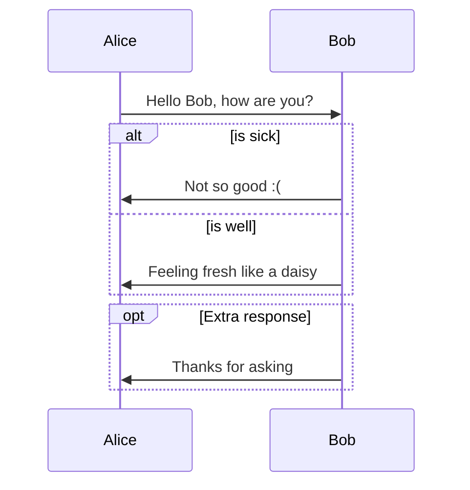
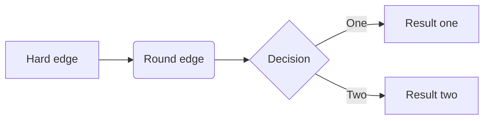
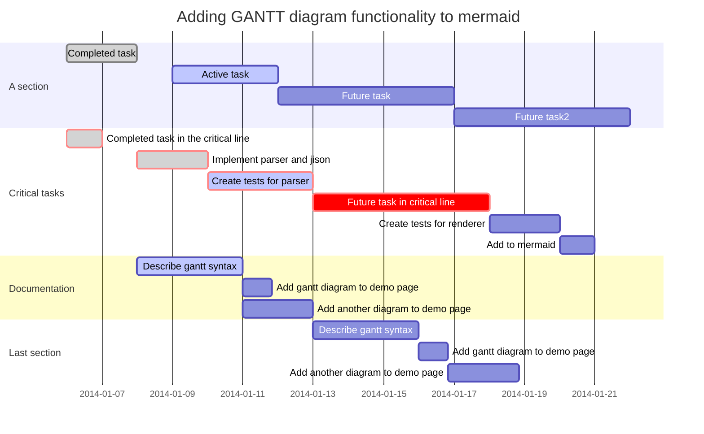

# Typora Tutorial for Markdown

[TOC]

> **Markdown** 是一种**轻量级**标记语言，创始人是**约翰·格鲁伯**（John Gruber）。它允许人们 “使用易读易写的纯文本格式编写文档，然后转换成有效的 HTML 文档。
>
> Typora是一款轻量级的Markdown 编辑器，重点在于所见即所得，与传统的两段显示不同，其极简的界面很受推崇。
>
> 这边简单介绍一下Typora上支持的markdown语法，因为这个博客markdown解析引擎的不同，有些语法不能很好的在博文里展现效果，感兴趣的话可以放到typora里尝试。

### 数学表达式

要启用这个功能，首先到`Preference`->`Editor`中启用。然后使用`$`符号包裹Tex命令，

例如：`$lim_{x \to \infty} \ exp(-x)=0$`将产生数学表达式：$lim_{x \to \infty} \ exp(-x)=0$

输入两个`$`符号，然后回车，就可以输入数学表达式块了。例如：

```
 $$\mathbf{V}_1 \times \mathbf{V}_2 =  \begin{vmatrix} \mathbf{i} & \mathbf{j} &   \mathbf{k} \\\frac{\partial X}{\partial u} &  \frac{\partial Y}{\partial u} & 0   \\\frac{\partial X}{\partial v} &  \frac{\partial Y}{\partial v} & 0 \\\end{vmatrix}$$ 
```

将会产生:

$$
\mathbf{V}_1 \times \mathbf{V}_2 =  \begin{vmatrix} \mathbf{i} & \mathbf{j} &   \mathbf{k} \\\frac{\partial X}{\partial u} &  \frac{\partial Y}{\partial u} & 0   \\\frac{\partial X}{\partial v} &  \frac{\partial Y}{\partial v} & 0 \\\end{vmatrix}
$$


关于更详细的LaTeX公式，可以参考[这篇博客](http://blog.163.com/goldman2000@126/blog/static/167296895201221242646561/) 


### 下标

下标使用`~`包裹，例如：`H~2~O`将产生水的分子式。 eg. $H_2O$ 


### 上标

上标使用`^`包裹，例如：`y^2^=4`将产生表达式 。 eg. $y^2=4$


### 插入表情

使用`:happy:`输入高兴的表情，使用`:sad:`输入悲伤的表情，使用`:cry:`输入哭的表情等。以此类推！

 

<br/>


### 下划线

用HTML的语法`<u>Underline</u>`将产生下划线   <u>Underline</u>. 

快捷键是`Ctrl+U` 


### 删除线

GFM添加了删除文本的语法，这是标准的Markdown语法木有的。使用`~~`包裹的文本将会具有删除的样式，例如`~删除文本~`将产生~~删除文本~~的样式。


### 代码

- 使用`包裹的内容将会以代码样式显示，例如

~~~
使用`printf()`  
~~~

则会产生`printf()`样式。

- 输入`~~~`或者```然后回车，可以输入代码块，并且可以选择代码的语言。例如：

~~~java
public Class HelloWorld{  
  System.out.println("Hello World!");  
}  
~~~


### 强调

使用两个*号或者两个_包裹的内容将会被强调。例如

~~~
**使用两个*号强调内容**
__使用两个下划线强调内容__
~~~

将会输出

**使用两个\*号强调内容**
__使用两个下划线强调内容__
Typora 推荐使用两个*号。


### 斜体

在标准的Markdown语法中，*和_包裹的内容会是斜体显示，但是GFM下划线一般用来分隔人名和代码变量名，因此我们推荐是用星号来包裹斜体内容。如果要显示星号，则使用转义：

```
\* 
```

 eg. *这是斜体*


### 插入图片

我们可以通过拖拉的方式，将本地文件夹中的图片或者网络上的图片插入。 


### 插入URL链接

使用尖括号包裹的url将产生一个连接，例如：`<www.baidu.com>`将产生连接: <www.baidu.com>.

如果是标准的url，则会自动产生连接，例如: <www.google.com>。

关于链接：英文输入下的中括号，里面填上你想写的话，然后在后面输入小括号里面贴上链接地址就可以了 ，它的快捷键是`Ctrl+K` 。

例如： `[百度一下](www.baidu.com)` 就可以变成 [百度一下](www.baidu.com)


### 目录列表Table of Contents（TOC）

输入[toc]然后回车，将会产生一个目录，这个目录抽取了文章的所有标题，自动更新内容。


### 水平分割线

使用`***`或者`---`，然后回车，来产生水平分割线。

------

------


### 标注

我们可以对某一个词语进行标注。例如

```
某些人用过了才知道[^注释]  
[^注释]:Somebody that I used to know.
```

将产生：

某些人用过了才知道[^注释]

[^注释]: Somebody that I used to know.

把鼠标放在`注释`上，将会有提示内容。


### 表格

```
|姓名|性别|毕业学校|工资|  
|:---|:---:|:---:|---:|  
|杨洋|男|重庆交通大学|3200|  
|峰哥|男|贵州大学|5000|  
|坑货|女|北京大学|2000|  
```

将产生:

| 姓名 | 性别 |   毕业学校   | 工资 |
| ---- | :--: | :----------: | ---: |
| 杨洋 |  男  | 重庆交通大学 | 3200 |
| 峰哥 |  男  |   贵州大学   | 5000 |
| 坑货 |  女  |   北京大学   | 2000 |

其中代码的第二行指定对齐的方式，第一个是左对齐，第二个和第三个是居中，最后一个是右对齐。

事实上，通过右键–>insert的形式打开的，当然也可以通过快捷键Ctrl+T来打开。填入行数与列数就可以了 。

 

### 任务列表

使用如下的代码创建任务列表，在[]中输入x表示完成，也可以通过点击选择完成或者没完成。

```
- [ ] 吃饭  
- [x] 逛街  
- [ ] 看电影  
- [ ] 约泡  
```

- [ ] 吃饭
- [x] 逛街
- [ ] 看电影
- [ ] 约泡


### 列表

输入+, -, *,(+空格)创建无序的列表，使用任意数字开头，创建有序列表，例如：

```
**无序的列表**  
* tfboys  
* 杨洋  
* 我爱你  
```

**无序的列表**

- tfboys
- 杨洋
- 我爱你

```
**有序的列表**  
1. 苹果  
6. 香蕉  
10. 我都不喜欢  
```

**有序的列表**

1. 苹果
2. 香蕉
3. 我都不喜欢

 

### 块引用

使用>来插入块引用。例如：

```
>这是一个块引用！  
```

将产生：

> 这是一个块引用！

 

### 标题

使用#表示一级标题，##表示二级标题，以此类推，有6个标题。

 

### Diagrams

*当前博客框架还没有 fully-support sequence, flowchart和Mermaid语法, 后续会逐步改进.*

#### Sequence 时序图

由 [js-sequence](https://bramp.github.io/js-sequence-diagrams/) 驱动，可以在 [这里](https://bramp.github.io/js-sequence-diagrams/#syntax) 找到语法解释

~~~gfm
```sequence
Alice->Bob: Hello Bob, how are you?
Note right of Bob: Bob thinks
Bob-->Alice: I am good thanks!
```
~~~

```sequence
Alice->Bob: Hello Bob, how are you?
Note right of Bob: Bob thinks
Bob-->Alice: I am good thanks!
```

#### FlowChart 流程图

由 [flowchart.js](http://flowchart.js.org/) 驱动。

~~~gfm
```flow
st=>start: Start
op=>operation: Your Operation
cond=>condition: Yes or No?
e=>end

st->op->cond
cond(yes)->e
cond(no)->op
```
~~~

```flow
st=>start: Start
op=>operation: Your Operation
cond=>condition: Yes or No?
e=>end

st->op->cond
cond(yes)->e
cond(no)->op
```

#### Mermaid 

Typora也支持`Mermaid`语法，包括流程图，时序图和甘特图。

##### 时序图

see [this doc](https://knsv.github.io/mermaid/#sequence-diagrams)

~~~gfm

~~~


##### 流程图

see [this doc](https://knsv.github.io/mermaid/#flowcharts-basic-syntax)

~~~gfm

~~~


##### 甘特图

see [this doc](https://knsv.github.io/mermaid/#gant-diagrams)

~~~gfm

~~~


### 常用快捷键

加粗：`Ctrl+B`

斜体：`Ctrl+I`

字体：`Ctrl+数字`

下划线：`Ctrl+U`

返回开头：`Ctrl+Home`

返回结尾：`Ctrl+End`

生成表格：`Ctrl+T`

创建链接：`Ctrl+K`


