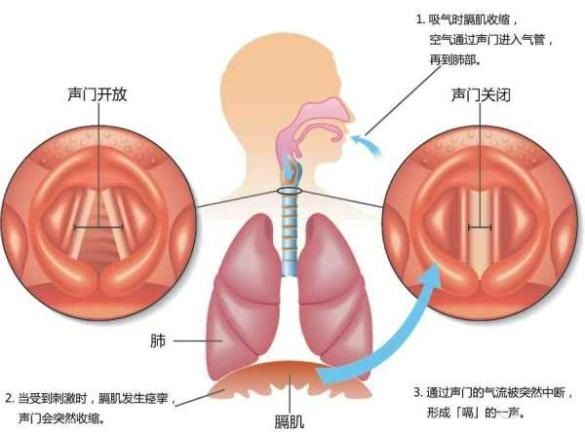

> 最近拔了几颗智齿，回家冰敷的时候好像不小心着凉了，结果后面的几天止不住的打嗝，真是遭不住。
>
> 然后就从网上找了一些止嗝的方法，别说有的还真的很有效，这里记录分享一下。

### 科学靠谱的止嗝方法：

* 屏住呼吸数秒或者坚持更长时间（亲测炒鸡有效，一般我会憋一分钟）
* 闭紧嘴巴，捏住鼻子呼气（原理和缓解耳朵闭气类似）
* 刺激咽后部，比如含大口凉水，然后分小口多次咽下
* 双膝抬起至胸口并且上身前倾

### 简单科普—啥是“打嗝”

打嗝比较官方的叫法又叫做“呃逆” ，其本质是一种神经反射，当呃逆反射弧受到刺激时，引起膈肌突然收缩，膈肌的急促收缩会引起人快速吸入空气，同时伴有喉部声门的关闭，随之形成了我们耳熟能详的打嗝声----“呃”。

膈肌指的是分隔胸部和腹部的肌肉，打嗝的动力源机器；而声门属于发声器。

### 引起打嗝的原因：

最常见的三种原因：

●吃的太多太快：胃部短时间内过于饱胀

●喝太多苏打水或其他起泡的饮料

●吞入过多空气

其实，任何刺激到呃逆反射弧的动作都能引起打嗝，除了前面三点，还有：咳嗽、情绪激动、大笑等等。生活中我们最常见到的就是在狼吞虎咽之后，食物和少量空气堆积在胃的顶部（医学上叫“胃底”），这个部位很容易刺激到膈肌，引起呃逆。

资料来源：[知乎--打嗝停不下来怎么办](https://zhuanlan.zhihu.com/p/30654542)