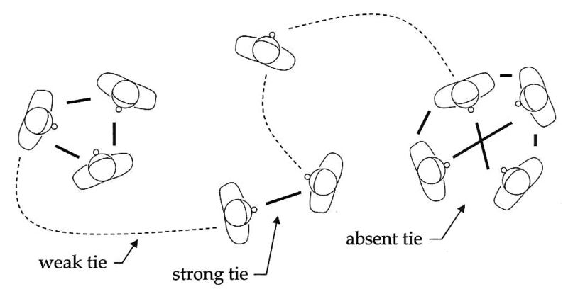

> In social network theory, social relationships are viewed in terms of ***nodes*** and ***ties***. Nodes are the individual actors within the networks, and ties are the relationships between the actors. There can be many kinds of ties between the nodes. In its simplest form, a social network is a map of all of the relevant **ties** between the nodes being studied.

### Weak Tie

The "**weak tie hypothesis**" argues, using a combination of **probability** and **mathematics**, if **A** is linked to both **B** and **C**, then there is a greater-than-chance probability that B and C are linked to each other: 

That is, if we consider any two randomly selected individuals, such as A and B, from the set S = A, B, C, D, E, ..., of all persons with ties to either or both of them, then, for example, if A is strongly tied to both B and C, then according to probability arguments, the B-C tie is always present. The absence of the B-C tie, in this situation, would create, according to Granovetter, what is called the ***forbidden triad***. In other words, the B-C tie, according to this logic, is **always present**, whether weak or strong, given the other two strong ties. In this direction, the "weak tie hypothesis" postulates that clumps or cliques of social structure will form, being bound predominately by "strong ties", and that "weak ties" will function as the **crucial bridge** between any two densely knit clumps of close friends.

### Strong Tie

According to [David Krackhardt](https://en.wikipedia.org/wiki/David_Krackhardt), there are some problems in the Granovetter definition. The first one refers to the fact that the Granovetter definition of the strength of a tie is a curvilinear prediction and his question is "how do we know where we are on this theoretical curve?". The second one refers to the affective character of strong ties. Krackhardt says that there are subjective criteria in the definition of the strength of a tie such as emotional intensity and the intimacy. He thought that strong ties are very important in severe changes and uncertainty:

> "People resist change and are uncomfortable with uncertainty. Strong ties constitute a base of trust that can reduce resistance and provide comfort in the face of uncertainty. This it will be argued that change is not facilitated by weak ties, but rather by a particular type of strong tie."

He called this particular type of strong tie *philo* and define *philos* relationship as one that meets the following three necessary and sufficient conditions:

1. *Interaction*: For A and B to be *philos*, A and B must interact with each other.
2. *Affection*: For A and B to be *philos*, A must feel affection for B.
3. *Time*: A and B, to be *philos*, must have a history of interactions with each other that have lasted over an extended period of time.

The combination of these qualities predicts trust and predicts that strong ties will be the critical ones in generating trust and discouraging malfeasance. When it comes to major change, change that may threaten the status quo in terms of power and the standard routines of how decisions are made, then trust is required. Thus, change is the product of *philos*.

### Positive ties and negative ties

Starting in the late 1940s, [Anatol Rapoport](https://en.wikipedia.org/wiki/Anatol_Rapoport) and others developed a probabilistic approach to the characterization of large social networks in which the nodes are persons and the links are acquaintanceship. During these years, formulas were derived that connected local parameters such as closure of contacts, and the supposed existence of the B-C tie to the global network property of connectivity.

Moreover, acquaintanceship (in most cases) is a **positive tie**. However, there are also **negative ties** such as animosity among persons. In considering the relationships of three, [Fritz Heider](https://en.wikipedia.org/wiki/Fritz_Heider) initiated a balance theory of relations. In a larger network represented by a graph, the totality of relations is represented by a signed graph.

This effort led to an important and non-obvious Structure Theorem for signed graphs, which was published by [Frank Harary](https://en.wikipedia.org/wiki/Frank_Harary) in 1953. A signed graph is called *balanced* if the product of the signs of all relations in every cycle is positive. A signed graph is unbalanced if the product is ever negative. The theorem says that if a network of interrelated positive and negative ties is balanced, then it consists of two subnetworks such that each has positive ties among its nodes and negative ties between nodes in distinct subnetworks. In other words, "my friend's enemy is my enemy". The imagery here is of a social system that splits into two cliques. There is, however, a special case where one of the two subnetworks may be empty, which might occur in very small networks.

In these two developments, we have mathematical models bearing upon the analysis of the structure. Other early influential developments in mathematical sociology pertained to process. For instance, in 1952 [Herbert A. Simon](https://en.wikipedia.org/wiki/Herbert_A._Simon) produced a mathematical formalization of a published theory of social groups by constructing a model consisting of a deterministic system of differential equations. A formal study of the system led to theorems about the dynamics and the implied equilibrium states of any group.

### Latent tie

Adding any network-based means of communication such as a new **IRC** channel (Internet Relay Chat), a social support group, a Webboard lays the groundwork for connectivity between formerly unconnected others. Similarly, laying an infrastructure, such as the Internet, intranets, wireless connectivity, grid computing, telephone lines, cellular service, or neighborhood networks, when combined with the devices that access them (phones, cellphones, computers, etc.) makes it possible for social networks to form. Such infrastructures make a connection available technically, even if not yet activated socially. These technical connections support latent social network ties, used here to indicate ties that are technically possible but not yet activated socially. They are only activated, i.e. converted from latent to weak, by some sort of social interaction between members, e.g. by telephoning someone, attending a group-wide meeting, reading and contributing to a Webboard, emailing others, etc. Given that such connectivity involves unrelated persons, the latent tie structure must be established by an authority beyond the persons concerned. Internet-based social support sites contain this profile. These are started by individuals with a particular interest in a subject who may begin by posting information and providing the means for online discussion.

