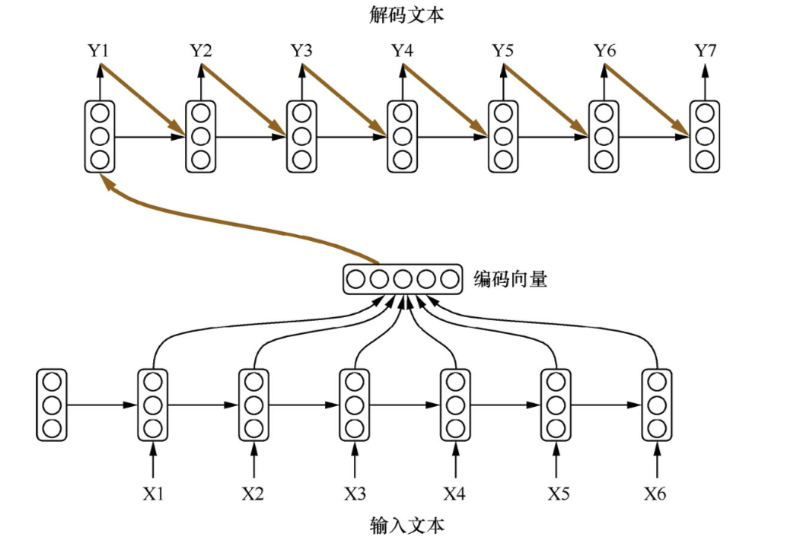
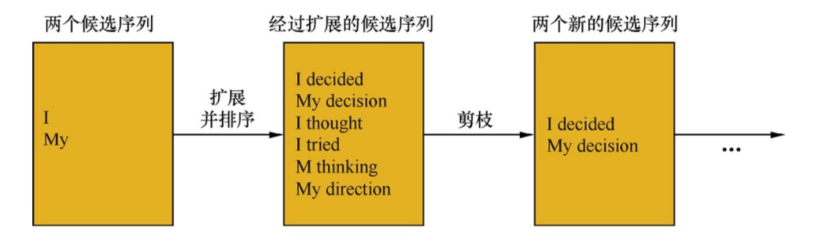
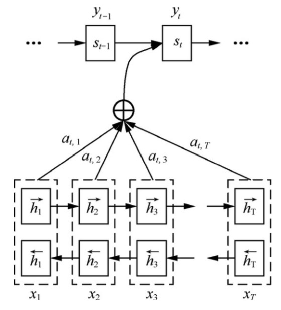
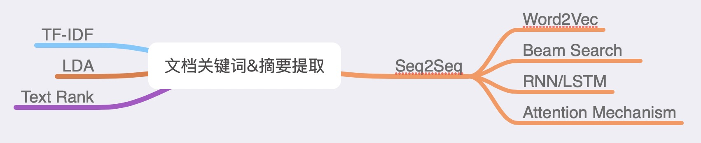

> 之前微众银行的面试里，因为项目经历中写到了两段NLP相关的项目，所以就问到了一些NLP相关的问题，其中有一些我当时没有答好，部门老大就把它们留给我回去思考。
>
> 现在把当时的答案和后来的想法和查资料的结果放在这里做一个对比。

[TOC]

## 1. 问题：

- 如果给你一篇论文，如何提取其中的关键字？
- 如果给你一篇论文，如何自动生成摘要？

## 2. 当时的答案

### 2.1 关键字提取

对于这个问题，当时基于之前在本科毕设中术语提取的经验，我给出了两种解决方案。

#### 2.1.1 词袋模型+词频分类

第一种想法是

- 通过词袋模型处理整个文本，得到一个单词和对应频数的字典，
- 停用词表过滤字典中的停用词，保留具有实际意义的词，
- 通过一些统计学指标，如频率，互信息或者TF-IDF值来赋予不同的词以权重，然后根据权重去筛选关键词。

#### 2.1.2 段落主题分类+词袋模型+词频分类

另一种思路也是基于第一种想法。

- 对整篇文档，按照段落对全文本进行LDA主题分类，得到段落分类结果，
- 然后对于每一类的段落重新进行[**2.1.1**](###### 2.1.1)中的处理策略，
- 将每类主题中的关键词提取结果，赋予每个主题的权重，整合排序，得到最终关键词。

### 2.2 摘要生成

这部分当时的想法是，把整篇文章以句子为单位，扔到RNN里去训练得到需要的结果，但是因为当时并不确定这样的方法是否可行，也觉得自己没法讲清楚具体流程，就没有回答。

### 2.3 思考

对于上面的解决办法，当时得到的反馈是在实际应用中基本行不通。回来思考了一下，的确有很多考虑不成熟的地方。

对于提取关键词的问题，

- 首先，在问题本身，需要考虑到关键词词长对于最终结果的影响，仅这一点，简单的词袋模型就不能很好解决；
- 然后，从方法上来看，统计学方法往往需要一个完整语料库的数据支持，但从一篇文章的内容上去做误差会很大；其次，大多数统计方法本身不能处理单词及其上下文关系，从而会忽略一部分信息；
- 最后，从实现的角度，还需要考虑到文章不同部分的影响，比如文章标题会包含重要信息，而实验结果和引用这两部分则需要考虑是否需要作为输入数据，以及排除可能有的附录等内容。

对于生成摘要的问题，

- 通过训练神经网络，如RNN，LSTM来主动生成摘要应该是一种可行的方案，但是因为在这方面缺少经验，需要进一步去学一下了解具体操作方案。

所以后面再根据Google得到的一些信息以及请教有这块项目经验的同学，得到现在的方法。

## 3. 现在的答案

### 3.1 解决策略：

总体来说，解决策略基于**Seq2Seq模型**来实现。分为以下几步：

#### 3.1.1 数据准备

选择了神经网络的监督学习方法，对包含标签的训练数据是必须的。这里我的想法是，爬取和目标文本同类别或者同领域的论文作为我们的语料库，从而保证最后生成摘要的风格不会偏差太多。

#### 3.1.2 预处理

- 将语料库本文的正文和摘要提取出来分别作为训练的输入和输出源
- 为了使encoder能够有效处理正文信息，所以需要对文本内容进行清洗
  - 去除文中除了 `,.?;:!` 等这类基础标点符号外的所有特殊符号
  - 替换文中的表格，公式，图片，数字等非文本信息为对应标签，如 `LABEL_TABLE`, `LABEL_FORMULA`, `LABEL_FIGURE`, `LABEL_NUMBER` 等
- 对正文和摘要分词，中文文本的话用 `jieba` 分词，英文的话就用 `NLTK` 分割短语。限制摘要和正文的总词数，既合理，又不至于过长影响训练效果。

#### 3.1.3 模型构建

整体可以采用 `Pytorch` 或者 `TensorFlow` 构建模型。核心就是通过网络将一个输入序列映射为一个输出序列。模型由一个编码器和一个解码器构成，其中每个部分分别是一个RNN，这两个RNN共同参与训练。这里选择LSTM替代Vanilla RNN。

编码器方面，逐个输入通过Word2Vec词向量化文本分词的词向量到每个LSTM Cell里，每个cell输出编码向量和隐状态向量，而序列中的下个cell则输入上个cell的隐状态和对应的词向量。

解码器方面，整体上是编码器的逆过程。在获取最终输出的时候，需要用到集束搜索 `beam search` 的方法, 即当解码器逐个输出单词时，主动保存到当前序列位置一定数量的局部较优的单词组合(句子候选项)，在最后输出时再从中选择出最优的候选项。下图是集束搜索的例子。

当处理序列过长的问题，LSTM也不一定可以保证长期记忆，所以这边还需要引入Attention机制和双向LSTM的网络结构。

##### 3.1.3.1. Attention机制

注意力机制指的是在解码的时候，每个解码单元的输入需要包含前一个隐向量和当前输出与输入序列中所有隐向量之间的联系，用一个语境向量表示。而这个语境向量由对所有输入隐向量的加权平均得到，这个权重则需要通过额外的神经网络训练而成。通常会选择多层感知机。个人理解这里选择多层感知机的原因是因为它比较简单，不至于把实现过程和整体网络变得过于复杂。

##### 3.1.3.2. 双向LSTM

同样，还是为了解决过长序列的记忆问题，这边还有一些小技巧。

比如建模时将源语言的句子逆序输入，或者重复两遍输入文本来提升性能。

此外，如下图，引入双向LSTM。使得在计算第i个词的语境向量时，可以考虑到 i 前后编码单元隐向量的的影响，保证前后文信息不被丢失。

##### 3.1.4. Bucket机制

理论上，RNN类网络可以支持任意长度的数据，但是实际操作中处理mini-batch和自动梯度计算并不容易实现，所以在构建网络的时候采用预设Bucket的方法。即，对于输入序列根据长度先做聚类，预设几个固定的长度的bucket，然后每个序列都放到它所属的bucket里面去，添加0-pad到bucket对应的长度。然后根据每个bucket去构建单独的计算图。通过这样的方式简化实现复杂度，并降低计算力上的开销。

##### 3.1.5 总结

不论是需要找到关键词或者生成摘要，理论上都可以通过Seq2Seq的方法来解决，需要做的就是在输出的时候指定不同的输出序列。

具体实现时，**3.1.1~3.1.4** 中提到的思路是一个整体流程，编码工作和网络搭建还需要参考 `Github` 上已有的项目实现，`TensorFlow` 也给了 Seq2Seq 的例子。

在网上搜集信息时，大部分遇到的项目还是以 新闻摘要和短信息提关键字 为主，对于文献摘要这类几千词的超长序列输入的问题，为了保证模型最终效率，网络搭建和实现策略的选择还要通过实验来确定。

### 3.2 其他想法

除去Seq2Seq的方法，还有一些传统的算法，也在这里记一下。

#### 3.2.1 TF-IDF

TF-IDF的基本思想是：词语的重要性与它在文件中出现的次数成正比，但同时会随着它在语料库中出现的频率成反比下降。

先上公式
$$
w_{i,j} = tf_{i, j} \times log(\frac{N}{df_i})
$$

其中 $w_{i,j}$ 表示单词 $i$ 在文档 $j$ 中的 `TF-IDF` 权值。

`TF`（Term Frequency）表示一个词在文档中出现的次数。

`DF`（Document Frequency）表示整个语料库中含有某个词的文档个数

`IDF`（Inverse Document Frequency）为逆文档频率，其计算公式为：
$$
IDF= log\bigg(\frac{语料库中文档总数}{(包含该词的文档数+1)}\bigg)
$$

如果没有加1，那么分母为零的时候会出错，因此必须加1。公式中没有加1，一般认为既然对这个词进行统计，这个词应该至少出现一次。这在训练模型的时候是正确的，但是在运用模型的时候，就不一定了。

TF-IDF关键词提取算法的一大缺点是：为了精确的提取一篇文档中的关键词，需要有一整个语料库来提供支持。这个问题的解决方法，通常是在一个通用的语料库上提前计算好所有词的IDF值，`jieba` 就是这么做的。这样的解决方案对于普通文档关键词提取有一定的效果，但是对于专业性稍微强一点的文档，表现就会差很多。因此如果是一个垂直领域，需要自己先对模型进行训练，形成一个IDF的库（里面装的东西就是一个数据框，一列是词语，一列是这个词语的IDF）。

#### 3.2.2 Text Rank

TextRank的思想是：通过词之间的相邻关系构建网络，然后用[PageRank](https://link.zhihu.com/?target=http%3A//www.cnblogs.com/en-heng/p/6124526.html)迭代计算每个节点的rank值，排序rank值即可得到关键词。

`PageRank`本来是`Google`提出，用来解决网页排名的问题，网页之间的链接关系即为图的边，迭代计算公式如下：
$$
PR(V_i) = (1-d) + d*\sum_{j\in In(V_i)}\frac{1}{Out(V_i)}PR(V_j)
$$

其中，$PR(V_i)$表示结点$V_i$的rank值，$In(V_i)$表示结点$V_i$的前驱结点集合，$Out(V_j)$表示结点$V_j$的后继结点集合，$d$ 为damping factor用于做平滑。

`TextRank` 将某一个词与其前面的N个词、以及后面的N个词均具有图相邻关系（类似于`N-gram`语法模型）。具体实现：设置一个长度为N的滑动窗口，所有在这个窗口之内的词都视作词结点的相邻结点；则TextRank构建的词图为无向图。

考虑到不同词对可能有不同的共现（co-occurrence），TextRank将共现作为无向图边的权值。那么，TextRank的迭代计算公式如下：
$$
TR(V_i) = (1-d) + d*\sum_{j\in In(V_i)}\frac{w_{j,i}}{\sum_{V_k\in Out(V_i)}w_{j,k}}TR(V_j)
$$

可以看出，该公式仅仅比PageRank多了一个权重项$W_{j,i}，用来表示两个节点之间的边连接有不同的重要程度。

TextRank用于关键词提取的算法如下：

1. 把给定的文本 $T$ 按照完整句子进行分割，即  $T = [S_1, S_2, \dots, S_m]$
2. 对于每个句子 $S_i$ 属于 $T$，进行分词和词性标注处理，并过滤掉停用词，只保留指定词性的单词，如名词、动词、形容词，即 $S_i=[t_{i,1}, t_{i,2},\dots, t_{i,n}]$, 其中 $t_{i,j}$是保留后的候选关键词。
3. 构建候选关键词图$G = (V,E)$，其中$V$为节点集，由 **2** 生成的候选关键词组成，然后采用**共现关系**（co-occurrence）构造任两点之间的边，两个节点之间存在边仅当它们对应的词汇在长度为$K$的窗口中共现，$K$表示窗口大小，即最多共现$K$个单词。
4. 根据上面公式，迭代传播各节点的权重，直至收敛。
5. 对节点权重进行倒序排序，从而得到最重要的$T$个单词，作为候选关键词。
6. 由 **5** 得到最重要的T个单词，在原始文本中进行标记，若形成相邻词组，则组合成多词关键词。

##### 3.2.2.1 TextRank算法提取关键词短语

　　提取关键词短语的方法基于关键词提取，可以简单认为：如果提取出的若干关键词在文本中相邻，那么构成一个被提取的关键短语。

##### 3.2.2.2 TextRank生成摘要

　　将文本中的每个句子分别看做一个节点，如果两个句子有相似性，那么认为这两个句子对应的节点之间存在一条无向有权边。考察句子相似度的方法是下面这个公式：
$$
Similarity(S_i, S_j)=\frac{\lvert\{w_k|w_k\in S_i\&w_k\in S_j\}\rvert}{log(\lvert S_i\rvert)+log(\lvert S_j\rvert)}
$$

公式中，$S_i$, $S_j$分别表示两个句子词的个数总数，$W_k$ 表示句子中的词，那么分子部分的意思是同时出现在两个句子中的同一个词的个数，分母是对句子中词的个数求对数之和。分母这样设计可以遏制较长的句子在相似度计算上的优势。

我们可以根据以上相似度公式循环计算任意两个节点之间的相似度，根据阈值去掉两个节点之间相似度较低的边连接，构建出节点连接图，然后计算TextRank值，最后对所有TextRank值排序，选出TextRank值最高的几个节点对应的句子作为摘要。

##### 3.2.2.3.对比总结

- `TextRank`与`TFIDF`均严重依赖于分词结果——如果某词在分词时被切分成了两个词，那么在做关键词提取时无法将两个词黏合在一起（TextRank有部分黏合效果，但需要这两个词均为关键词）。因此是否添加标注关键词进自定义词典，将会造成准确率、召回率大相径庭。
- `TextRank`的效果并不优于`TFIDF`。
- `TextRank`虽然考虑到了词之间的关系，但是仍然倾向于将频繁词作为关键词。

此外，由于`TextRank`涉及到构建词图及迭代计算，所以提取速度较慢。

发现以上两种方法本质上还是基于词频，这也导致了我们在进行自然语言处理的时候造成的弊端，因为我们阅读一篇文章的时候，并不是意味着主题词会一直出现，特别对于中文来说，蕴含的中心思想也往往不是一两个词能够说明的。所以现有的方法中，训练 `Seq2Seq` 网络的方式还是占据主流。

本文部分内容来自：[【知乎】HopeR的答案](https://zhuanlan.zhihu.com/p/53841879),  [【知乎】梦里寻梦的答案](