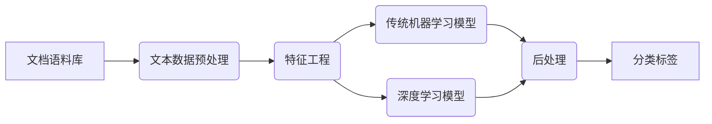
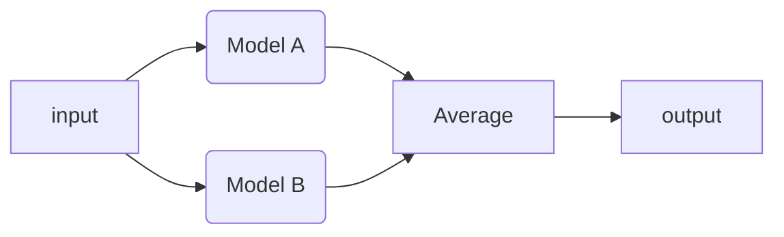

> 文本文档分类是NLP领域一个基础而又经典的话题，决定开始在NLP方向开展学习工作，这方面的基础知识必不可少，这里把这两天搜集的内容简单整理一下，以供后面深入探究。

[TOC]

## 1. 文档分类概述

**文本分类**通过算法对输入的文本按照一定的类目体系进行自动化归类的过程，**文档分类**正是文本分类领域的一项分支。完整的流程包括数据预处理、特征工程、算法选择、模型构建以及后处理和效果评估。

文档分类有一点需要注意的两个概念：多标签分类（Multi-Label Classification）和多类别分类（Multi-Class Classification）。其中多类别分类区别于二分类问题，即在 $n(n>2)$ 个类别中互斥地选取一个作为输出；而多标签分类，是在n个标签中非互斥地选取 $m(m<n)$ 个标签作为输出。

## 2. 文档分类方法

### 2.1 传统机器学习方法

如上图所示，文档分类问题的机器学习解决办法一般分为数据预处理，特征提取和文本表征，模型选择和训练，以及可选择的实用一定的后处理，最终得到想要的分类标签。

#### 2.1.1 文档预处理

* 数据清洗

  如果不是处理好的语料库，正常文档中会有一些与训练输入数据无关的信息，需要提前去除，以防引入噪声，主要有以下几类。

  * 非文本数据
    HTML，XML等代码，或者URL等内容
  * 长串数字和字母
  * 无意义文本
    文本中与正文无关的内容，比如广告，版权声明等

* 分词&词性标注

  * 对于中文文本，分词是必须的；而英文文本则需要根据具体情况去判断是否需要划分词组。
  * 完成分词之后，给分好的词标注词性，可以简化和优化后续处理的难度。

  中文分词，工业届比较常用的是`jiaba`分词，同时比较有名的还有`HanLP`和清华的`THULAC`等；英文分词则以斯坦福的`NLTK`为主流。
  词性标注同样可以通过调用上述库提供的方法，也可以根据一些库中提供的模型框架重新训练词性标注工具。

#### 2.1.2 特征工程

文本分类的特征工程一般会有两方面内容，一个是文本表征，一个是特征提取。所谓文本表征就是把文本信息转化为机器能够识别的数据表示，特征提取指的是根据统计或者概率从文本中提取出相应的指标作为文本特征。

##### 2.1.2.1 Word_embedding

通过词与上下文、上下文与词的关系，有效地将词映射为低维稠密的向量，可以很好的表示词，一般是把训练和测试的语料都用来做word_embedding。Embedding后的词向量或者段落矩阵就可以用作传统机器学习的特征，也是深度学习方法的必备输入。

常见的word-embedding方法有`word2vec`，基于`word2vec`的`doc2vec`，以及斯坦福的`glove`等。

##### 2.1.2.2 特征提取

* [TF-IDF](https://www.zhihu.com/search?type=content&q=tf-idf)(词频-逆文档频率)

  TF-IDF的基本思想是，词语的重要性与它在文件中出现的次数成正比，但同时会随着它在语料库中出现的频率成反比下降。用以评估词对于一个文档集或一个语料库中的其中一个文档的重要程度，计算出来是一个$D\times N$维的矩阵，其中$D$为文档的数量，$N$为词的个数，通常会加入N-gram，也就是计算文档中N个相连词的的TF-IDF。在`sklearn`中可以找到相应的库函数。

* [LDA](https://zhuanlan.zhihu.com/p/31470216)(隐狄利克雷分布)

  假设文档集有$T$个话题，一篇文档可能属于一个或多个话题，通过LDA模型可以计算出文档属于某个话题的概率，这样可以计算出一个$D\times T$的矩阵。LDA特征在文档打标签等任务上表现很好。

* [LSI](https://zhuanlan.zhihu.com/p/29930654)(隐语义索引)
  通过分解文档-词频矩阵来计算文档的潜在语义，和LDA有一点相似，都是分析文档的潜在特征来对文档进行主题分类。

上述的几种特征提取方式，和word2vec一样，都可以在`gensim`库函数中找到。

##### 2.1.2.3 特征筛选

尽可能选取任务敏感的特征，也就是特征足够强可以影响分类的结果。一般用树模型判断特征的重要程度，`xgboost`的`get_fscore`就可以实现这一功能。

计算特征强度之后，选取较强的特征，摒弃弱特征。可以尝试组合不同的特征来构造新的特征，然后测试新特征的强弱，反复如此获取更多的强特征。但是这样的方法也要注意变量之间的共线性程度，以防影响最后模型训练效果。

#### 2.1.3 模型选择

特征提取相当于构造了一个$D\times F$的矩阵，其中$D$为文档数量，$F$为特征数量，一篇文档用$N$维空间上的一个点表示，成为一个数学问题：如何将点分类。

传统的模型有很多，比如朴素贝叶斯、逻辑回归、SVM、决策树、神经网络等分类算法，其中树结构很适合文档分类。当前效果比较好的是LightGBM和XGBoost。其中调参的经验是树的深度不要太深、让树尽可能矮宽，这样分类比较充分，一般深度为4~6就行。

最后得到几个效果差不多的模型后，适度采用Stacking的方法往往可以提高最后的分类效果。

### 2.2 深度学习方法

#### 2.2.1 FastText

由 Word2Vec的作者在【1】中提出，是一种极致简单的模型，结构如下图。

原理是把句子中所有的词向量进行平均（某种意义上可以理解为只有一个avg pooling特殊CNN），然后直接接 softmax 层。其中也加入了一些 N-Gram 特征的技巧来捕获局部序列信息。也就是说不必做过多的非线性转换、特征组合即可捕获很多分类信息，因此有些任务即便简单的模型便可以解决。

#### 2.2.2 TextCNN

文章【2】中介绍了非常经典TextCNN模型，详细过程如下图所示。

第一层是图中最左边的 $7\times 5$ 的句子矩阵，每行是词向量，维度 $d=5$，这个可以类比为图像中的原始像素点。

然后经过有 $filter\_size=(2,3,4)$ 的一维卷积层。对于文本数据，filter不再横向滑动，仅仅是向下移动，有点类似于N-gram在提取词与词间的局部相关性。图中共有三种步长策略，分别是2,3,4，每个步长都有两个filter（实际训练时filter数量会很多）。在不同词窗上应用不同filter，最终得到6个卷积后的向量。

第三层是一个1-max pooling层，对每一个向量进行最大化池化操作并拼接各个池化值，最终得到这个句子的特征表示。每个filter_size 有两个输出 channel。这样不同长度句子经过pooling层之后都能变成定长的表示。

最后接一层全连接的 softmax 层，输出每个类别的概率。

过程中比较关键的几点是：

* **特征**：这里的特征就是词向量，有静态（static）和非静态（non-static）方式。static方式采用比如word2vec预训练的词向量，训练过程不更新词向量，实质上属于迁移学习了，特别是数据量比较小的情况下，采用静态的词向量往往效果不错。non-static则是在训练过程中更新词向量。推荐的方式是 non-static 中的 fine-tunning方式，它是以预训练（pre-train）的word2vec向量初始化词向量，训练过程中调整词向量，能加速收敛。

* **通道（Channels）**：图像中可以利用 (R, G, B) 作为不同channel，而文本的输入的channel通常是不同方式的embedding方式（比如 word2vec或Glove），实践中也有利用静态词向量和fine-tunning词向量作为不同channel的做法。

* **一维卷积（conv-1d）**：图像是二维数据，经过词向量表达的文本为一维数据，因此在TextCNN卷积用的是一维卷积。一维卷积带来的问题是需要设计通过不同 filter_size 的 filter 获取不同宽度的视野。

#### 2.2.3 TextRNN + Attention

论文【3】 中介绍了RNN用于分类问题的设计，下图LSTM用于网络结构原理示意图，示例中的是利用最后一个词的结果直接接全连接层softmax输出。

而这里的Attention注意力机制是自然语言处理领域一个常用的建模长时间记忆机制，能够很直观的给出每个词对结果的贡献。【4】详细介绍了注意力机制的原理。

实际应用中可以根据【5】中提出的基于Hierarchical Attention的RNN去训练深度网络，大致结构如下。

### 2.2.4 RCNN

RCNN模型在这篇文章【6】中被提出，文中将RNN和CNN以另外一种方式呈现，又可以作为一种思路去训练文本数据。

模型中把CNN模型中的卷积的部分使用RNN代替了，最后加上池化层。而这个RNN层做的事情是，将每一个词分别和左边的词以及右边的词进行融合。

每以文本先经过1层双向LSTM，该词的左侧的词正向输入进去得到一个词向量，该词的右侧反向输入进去得到一个词向量。再结合该词的词向量，生成一个 3维的组合词向量。然后再将这些新的词向量传入全连接层，紧接着是最大化池化层进行特征降维。最后接上全连接层，便完成多分类任务。

### 2.2.5 其他方法

除了上述的三种模型外，还有很多基于上述模型的变种和衍生。此外训练方式上也可以采用一些特殊的方法。我们知道一般一篇文档由标题，正文和其他成分构成。这里我们可以主要提取标题和正文，并且分开去训练；或者只是用正文去训练。

因此可以得到多个模型构建策略，如下（没有列出所有）：

* TextCNN处理正文，不使用标题
* Hierarchical Attention based RNN处理正文，不使用标题
* RCNN处理正文，多层CNN处理标题

联合模型学习的方法会在上述等多个单模型中选取表现最好的2个单模型，在数据集上预训练到最优，然后联合在一起训练。也可以联合多个单模型一起训练，但缺点就是训练时间过长。

大致流程如下图，可以共享input生成的Embedding层，也可以不共享，根据具体情况而定。

## 参考文献

【1】[Bag of Tricks for Efficient Text Classification](https://arxiv.org/pdf/1607.01759v2.pdf) 

【2】[Convolutional Neural Networks for Sentence Classification](https://arxiv.org/pdf/1408.5882.pdf)

【3】[Recurrent Neural Network for Text Classification with Multi-Task Learning](https://www.ijcai.org/Proceedings/16/Papers/408.pdf)

【4】[Neural Machine translation by Jointly Learning to Align and Translate](https://arxiv.org/pdf/1409.0473v7.pdf)

【5】[Hierarchical Attention Networks for Document Classification](https://www.cs.cmu.edu/~./hovy/papers/16HLT-hierarchical-attention-networks.pdf)

【6】[Recurrent Convolutional Neural Networks for Text Classification](http://www.nlpr.ia.ac.cn/cip/~liukang/liukangPageFile/Recurrent Convolutional Neural Networks for Text Classification.pdf))