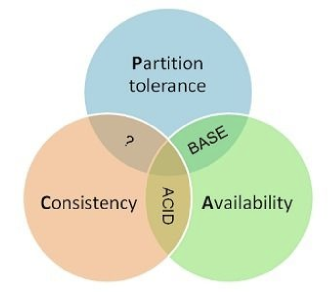

[TOC]

## 数据库基础

### 1. 事务

事务指的是满足 ACID 特性的一组操作，可以通过 Commit 提交一个事务，也可以使用 Rollback 进行回滚。


#### 1.1 ACID

1. 原子性（Atomicity）

   事务被视为不可分割的最小单元，事务的所有操作要么全部提交成功，要么全部失败回滚。

   回滚可以用回滚日志来实现，回滚日志记录着事务所执行的修改操作，在回滚时反向执行这些修改操作即可。 

2. 一致性（Consistency）

   数据库在事务执行前后都保持一致性状态。在一致性状态下，所有事务对一个数据的读取结果都是相同的。

3. 隔离性（Isolation）

   一个事务所做的修改在最终提交以前，对其它事务是不可见的。

4. 持久性（Durability）

   一旦事务提交，则其所做的修改将会永远保存到数据库中。即使系统发生崩溃，事务执行的结果也不能丢失。

   使用重做日志来保证持久性。

事务的 ACID 特性概念简单，但不是很好理解，主要是因为这几个特性不是一种平级关系：

- 只有满足一致性，事务的执行结果才是正确的。
- 在无并发的情况下，事务串行执行，隔离性一定能够满足。此时只要能满足原子性，就一定能满足一致性。
- 在并发的情况下，多个事务并行执行，事务不仅要满足原子性，还需要满足隔离性，才能满足一致性。
- 事务满足持久化是为了能应对数据库崩溃的情况。


#### 1.2 AUTOCOMMIT

MySQL 默认采用自动提交模式。也就是说，如果不显式使用`START TRANSACTION`语句来开始一个事务，那么每个查询都会被当做一个事务自动提交。

### 2. 并发一致性问题

在并发环境下，事务的隔离性很难保证，因此会出现很多并发一致性问题。

#### 2.1 丢失修改

T1 和 T2 两个事务都对一个数据进行修改，T1 先修改，T2 随后修改，T2 的修改覆盖了 T1 的修改。


#### 2.2 读脏数据

T1 修改一个数据，T2 随后读取这个数据。如果 T1 撤销了这次修改，那么 T2 读取的数据是脏数据。


#### 2.3 不可重复读

T2 读取一个数据，T1 对该数据做了修改。如果 T2 再次读取这个数据，此时读取的结果和第一次读取的结果不同。


#### 2.4 幻影读

T1 读取某个范围的数据，T2 在这个范围内插入新的数据，T1 再次读取这个范围的数据，此时读取的结果和和第一次读取的结果不同。


产生并发不一致性问题主要原因是破坏了事务的隔离性，解决方法是通过并发控制来保证隔离性。并发控制可以通过封锁来实现，但是封锁操作需要用户自己控制，相当复杂。数据库管理系统提供了事务的隔离级别，让用户以一种更轻松的方式处理并发一致性问题。

### 3. 封锁 - 通过锁保证事务隔离性

#### 3.1 封锁粒度

MySQL 中提供了两种封锁粒度：**行级锁**以及**表级锁**。

应该尽量只锁定需要修改的那部分数据，而不是所有的资源。锁定的数据量越少，发生锁争用的可能就越小，系统的<u>并发程度</u>就越高。

但是加锁需要消耗资源，锁的各种操作（包括获取锁、释放锁、以及检查锁状态）都会增加系统开销。因此封锁粒度越小，系统开销就越大。

在选择封锁粒度时，需要在锁开销和并发程度之间做一个权衡。

#### 3.2 封锁类型

##### 1. 读写锁

- 排它锁（Exclusive），简写为 X 锁，又称写锁。
- 共享锁（Shared），简写为 S 锁，又称读锁。

有以下两个规定：

- 一个事务对数据对象 A 加了 X 锁，就可以对 A 进行读取和更新。加锁期间其它事务不能对 A 加任何锁。
- 一个事务对数据对象 A 加了 S 锁，可以对 A 进行读取操作，但是不能进行更新操作。加锁期间其它事务能对 A 加 S 锁，但是不能加 X 锁。

锁的兼容关系如下：

|   -   |  X   |  S   |
| :---: | :--: | :--: |
| **X** |  ×   |  ×   |
| **S** |  ×   |  √   |

##### 2. 意向锁

使用**意向锁**（Intention Locks）可以更容易地支持多粒度封锁。

在存在行级锁和表级锁的情况下，事务 T 想要对表 A 加 X 锁，就需要先检测是否有其它事务对表 A 或者表 A 中的任意一行加了锁，那么就需要对表 A 的每一行都检测一次，这是非常耗时的。

意向锁在原来的 X/S 锁之上引入了 IX/IS，IX/IS 都是表锁，用来表示一个事务想要在表中的某个数据行上加 X 锁或 S 锁。有以下两个规定：

- 一个事务在获得某个数据行对象的 S 锁之前，必须先获得表的 IS 锁或者更强的锁；
- 一个事务在获得某个数据行对象的 X 锁之前，必须先获得表的 IX 锁。

通过引入意向锁，事务 T 想要对表 A 加 X 锁，只需要先检测是否有其它事务对表 A 加了 X/IX/S/IS 锁，如果加了就表示有其它事务正在使用这个表或者表中某一行的锁，因此事务 T 加 X 锁失败。

各种锁的兼容关系如下：

|   -    |  X   |  IX  |  S   |  IS  |
| :----: | :--: | :--: | :--: | :--: |
| **X**  |  ×   |  ×   |  ×   |  ×   |
| **IX** |  ×   |  √   |  ×   |  √   |
| **S**  |  ×   |  ×   |  √   |  √   |
| **IS** |  ×   |  √   |  √   |  √   |

解释如下：

- 任意 IS/IX 锁之间都是兼容的，因为它们只是表示想要对表加锁，而不是真正加锁；
- S 锁只与 S 锁和 IS 锁兼容，也就是说事务 T 想要对数据行加 S 锁，其它事务可以已经获得对表或者表中的行的 S 锁。

#### 3.3 封锁协议

##### 1. 三级锁协议

1. **一级封锁协议**

   事务 T 要修改数据 A 时必须加 X 锁，直到 T 结束才释放锁。

   可以解决丢失修改问题，因为不能同时有两个事务对同一个数据进行修改，那么事务的修改就不会被覆盖。

| T1          | T2           |
| ----------- | ------------ |
| lock-x(A)   |              |
| read A=20   |              |
|             | lock-x(A)    |
|             | wait         |
| write A=19  | .            |
| commit      | .            |
| unlock-x(A) | .            |
|             | obtain       |
|             | read A=19    |
|             | write A=21   |
|             | commit       |
|             | unlock-x(A2) |

2. **二级封锁协议**

   在一级的基础上，要求读取数据 A 时必须加 S 锁，读取完马上释放 S 锁。

   可以解决读脏数据问题，因为如果一个事务在对数据 A 进行修改，根据 1 级封锁协议，会加 X 锁，那么就不能再加 S 锁了，也就是不会读入数据。

| T1          | T2          |
| ----------- | ----------- |
| lock-x(A)   |             |
| read A=20   |             |
| write A=19  |             |
|             | lock-s(A)   |
|             | wait        |
| rollback    | .           |
| A=20        | .           |
| unlock-x(A) | .           |
|             | obtain      |
|             | read A=20   |
|             | unlock-s(A) |
|             | commit      |

3. **三级封锁协议**

   在二级的基础上，要求读取数据 A 时必须加 S 锁，直到事务结束了才能释放 S 锁。

   可以解决不可重复读的问题，因为读 A 时，其它事务不能对 A 加 X 锁，从而避免了在读的期间数据发生改变。

| T1          | T2          |
| ----------- | ----------- |
| lock-s(A)   |             |
| read A=20   |             |
|             | lock-x(A)   |
|             | wait        |
| read A=20   | .           |
| commit      | .           |
| unlock-s(A) | .           |
|             | obtain      |
|             | read A=20   |
|             | write A=19  |
|             | commit      |
|             | unlock-X(A) |

##### 2. 两段锁协议

加锁和解锁分为两个阶段进行。

可串行化调度是指，通过并发控制，使得并发执行的事务结果与某个串行执行的事务结果相同。

事务遵循两段锁协议是保证可串行化调度的充分条件。例如以下操作满足两段锁协议，它是可串行化调度。

```html
lock-x(A)...lock-s(B)...lock-s(C)...unlock(A)...unlock(C)...unlock(B)
```

但不是必要条件，例如以下操作不满足两段锁协议，但是它还是可串行化调度。

```html
lock-x(A)...unlock(A)...lock-s(B)...unlock(B)...lock-s(C)...unlock(C)
```

#### 3.4 MySQL 隐式与显示锁定

MySQL 的 InnoDB 存储引擎采用两段锁协议，会根据隔离级别在需要的时候自动加锁，并且所有的锁都是在同一时刻被释放，这被称为隐式锁定。

InnoDB 也可以使用特定的语句进行显示锁定：

```sql
SELECT ... LOCK In SHARE MODE;
SELECT ... FOR UPDATE;
```

### 4. 隔离级别

#### 4.1 未提交读（READ UNCOMMITTED）

事务中的修改，即使没有提交，对其它事务也是可见的。

#### 4.2 提交读（READ COMMITTED）

一个事务只能读取已经提交的事务所做的修改。换句话说，一个事务所做的修改在提交之前对其它事务是不可见的。

#### 4.3 可重复读（REPEATABLE READ）

保证在同一个事务中多次读取同样数据的结果是一样的。

#### 4.4 可串行化（SERIALIZABLE）

强制事务串行执行。

需要加锁实现，而其它隔离级别通常不需要。

| 隔离级别 | 脏读 | 不可重复读 | 幻影读 |
| -------- | ---- | ---------- | ------ |
| 未提交读 | √    | √          | √      |
| 提交读   | ×    | √          | √      |
| 可重复读 | ×    | ×          | √      |
| 可串行化 | ×    | ×          | ×      |

### 5.多版本并发控制(MVCC)

多版本并发控制（Multi-Version Concurrency Control, MVCC）是 MySQL 的 InnoDB 存储引擎实现隔离级别的一种具体方式，用于实现提交读和可重复读这两种隔离级别。而未提交读隔离级别总是读取最新的数据行，无需使用 MVCC。可串行化隔离级别需要对所有读取的行都加锁，单纯使用 MVCC 无法实现。

#### 5.1 版本号

- 系统版本号：是一个递增的数字，每开始一个新的事务，系统版本号就会自动递增。
- 事务版本号：事务开始时的系统版本号。

#### 5.2 隐藏的列

MVCC 在每行记录后面都保存着两个隐藏的列，用来存储两个版本号：

- 创建版本号：指示创建一个数据行的快照时的系统版本号；

* 删除版本号：如果该快照的删除版本号大于当前事务版本号表示该快照有效，否则表示该快照已经被删除

innodb存储引擎中，每行数据都包含了一些隐藏字段： `DB_ROW_ID`、 `DB_TRX_ID`、 `DB_ROLL_PTR` 和 `DELETE_BIT`。


- `DB_TRX_ID`：用来标识最近一次对本行记录做修改的事务的标识符，即最后一次修改本行记录的事务id。对应上述的创建版本号。 delete操作在内部来看是一次update操作，更新行中的删除标识位 `DELELE_BIT`。
- `DB_ROLL_PTR`：指向当前数据的**`undo log`**记录，回滚数据通过这个指针来寻找记录被更新之前的内容信息。
- `DB_ROW_ID`：包含一个随着新行插入而单调递增的行ID, 当由innodb自动产生聚集索引时，聚集索引会包括这个行ID的值，否则这个行ID不会出现在任何索引中。
- `DELELE_BIT`：用于标识该记录是否被删除。

#### 5.3 Undo 日志

MVCC 使用到的快照存储在 Undo 日志中，该日志通过回滚指针把一个数据行（Record）的所有快照连接起来。


#### 5,4 实现过程

以下实现过程针对可重复读隔离级别。

当开始一个事务时，该事务的版本号肯定大于当前所有数据行快照的创建版本号，理解这一点很关键。数据行快照的创建版本号是创建数据行快照时的系统版本号，系统版本号随着创建事务而递增，因此新创建一个事务时，这个事务的系统版本号比之前的系统版本号都大，也就是比所有数据行快照的创建版本号都大。

* SELECT

  多个事务必须读取到同一个数据行的快照，并且这个快照是距离现在最近的一个有效快照。但是也有例外，如果有一个事务正在修改该数据行，那么它可以读取事务本身所做的修改，而不用和其它事务的读取结果一致。

  把没有对一个数据行做修改的事务称为 T，T 所要读取的数据行快照的创建版本号必须小于等于 T 的版本号，因为如果大于 T 的版本号，那么表示该数据行快照是其它事务的最新修改，因此不能去读取它。除此之外，T 所要读取的数据行快照的删除版本号必须是未定义或者大于 T 的版本号，因为如果小于等于 T 的版本号，那么表示该数据行快照是已经被删除的，不应该去读取它。

* INSERT

  将当前系统版本号作为数据行快照的创建版本号。

* DELETE

  将当前系统版本号作为数据行快照的删除版本号。

* UPDATE

  将当前系统版本号作为更新前的数据行快照的删除版本号，并将当前系统版本号作为更新后的数据行快照的创建版本号。可以理解为先执行 DELETE 后执行 INSERT。

#### 5.5 快照读与当前读

1. 快照读

   使用 MVCC 读取的是快照中的数据，这样可以减少加锁所带来的开销。

```sql
select * from table ...;
```

2. 当前读

   读取的是最新的数据，需要加锁。以下第一个语句需要加 S 锁，其它都需要加 X 锁。

```sql
select * from table where ? lock in share mode;
select * from table where ? for update;
insert;
update;
delete;
```

### 6. Next-Key Locks

Next-Key Locks 是 MySQL 的 InnoDB 存储引擎的一种锁实现。

MVCC 不能解决幻影读问题，Next-Key Locks 就是为了解决这个问题而存在的。在可重复读（REPEATABLE READ）隔离级别下，使用 MVCC + Next-Key Locks 可以解决幻读问题。

#### 6.1 Record Locks

锁定一个记录上的索引，而不是记录本身。

如果表没有设置索引，InnoDB 会自动在主键上创建隐藏的聚簇索引，因此 Record Locks 依然可以使用。

#### 6.2 Gap Locks

锁定索引之间的间隙，但是不包含索引本身。例如当一个事务执行以下语句，其它事务就不能在 t.c 中插入 15。

```sql
SELECT c FROM t WHERE c BETWEEN 10 and 20 FOR UPDATE;
```

#### 6.3 Next-Key Locks

它是 Record Locks 和 Gap Locks 的结合，不仅锁定一个记录上的索引，也锁定索引之间的间隙。例如一个索引包含以下值：10, 11, 13, and 20，那么就需要锁定以下区间：

```sql
(-∞, 10]
(10, 11]
(11, 13]
(13, 20]
(20, +∞)
```

### 7. 关系数据库设计理论

#### 7.1 函数依赖

记 A->B 表示 A 函数决定 B，也可以说 B 函数依赖于 A。

如果 {A1，A2，... ，An} 是关系的一个或多个属性的集合，该集合函数决定了关系的其它所有属性并且是最小的，那么该集合就称为键码。

对于 A->B，如果能找到 A 的真子集 A'，使得 A'-> B，那么 A->B 就是部分函数依赖，否则就是完全函数依赖。

对于 A->B，B->C，则 A->C 是一个传递函数依赖。

### 7.2 异常

以下的学生课程关系的函数依赖为 {Sno, Cname} -> {Sname, Sdept, Mname, Grade}，键码为 {Sno, Cname}。也就是说，确定学生和课程之后，就能确定其它信息。

| Sno  | Sname  | Sdept  | Mname  | Cname  | Grade |
| ---- | ------ | ------ | ------ | ------ | ----- |
| 1    | 学生-1 | 学院-1 | 院长-1 | 课程-1 | 90    |
| 2    | 学生-2 | 学院-2 | 院长-2 | 课程-2 | 80    |
| 2    | 学生-2 | 学院-2 | 院长-2 | 课程-1 | 100   |
| 3    | 学生-3 | 学院-2 | 院长-2 | 课程-2 | 95    |

不符合范式的关系，会产生很多异常，主要有以下四种异常：

- 冗余数据：例如 `学生-2` 出现了两次。
- 修改异常：修改了一个记录中的信息，但是另一个记录中相同的信息却没有被修改。
- 删除异常：删除一个信息，那么也会丢失其它信息。例如删除了 `课程-1` 需要删除第一行和第三行，那么 `学生-1` 的信息就会丢失。
- 插入异常：例如想要插入一个学生的信息，如果这个学生还没选课，那么就无法插入。

### 7.3 范式

范式理论是为了解决以上提到四种异常。

高级别范式的依赖于低级别的范式，1NF 是最低级别的范式。

##### 1. 第一范式 (1NF)]

属性不可分。

##### 2. 第二范式 (2NF)

每个非主属性完全函数依赖于键码。

可以通过分解来满足。

**分解前** 

| Sno  | Sname  | Sdept  | Mname  | Cname  | Grade |
| ---- | ------ | ------ | ------ | ------ | ----- |
| 1    | 学生-1 | 学院-1 | 院长-1 | 课程-1 | 90    |
| 2    | 学生-2 | 学院-2 | 院长-2 | 课程-2 | 80    |
| 2    | 学生-2 | 学院-2 | 院长-2 | 课程-1 | 100   |
| 3    | 学生-3 | 学院-2 | 院长-2 | 课程-2 | 95    |

以上学生课程关系中，{Sno, Cname} 为键码，有如下函数依赖：

- Sno -> Sname, Sdept
- Sdept -> Mname
- Sno, Cname-> Grade

Grade 完全函数依赖于键码，它没有任何冗余数据，每个学生的每门课都有特定的成绩。

Sname, Sdept 和 Mname 都部分依赖于键码，当一个学生选修了多门课时，这些数据就会出现多次，造成大量冗余数据。

**分解后** 

关系-1

| Sno  | Sname  | Sdept  | Mname  |
| ---- | ------ | ------ | ------ |
| 1    | 学生-1 | 学院-1 | 院长-1 |
| 2    | 学生-2 | 学院-2 | 院长-2 |
| 3    | 学生-3 | 学院-2 | 院长-2 |

有以下函数依赖：

- Sno -> Sname, Sdept
- Sdept -> Mname

关系-2

| Sno  | Cname  | Grade |
| ---- | ------ | ----- |
| 1    | 课程-1 | 90    |
| 2    | 课程-2 | 80    |
| 2    | 课程-1 | 100   |
| 3    | 课程-2 | 95    |

有以下函数依赖：

- Sno, Cname -> Grade

##### 3. 第三范式 (3NF)

非主属性不传递函数依赖于键码。

上面的 关系-1 中存在以下传递函数依赖：

- Sno -> Sdept -> Mname

可以进行以下分解：

关系-11

| Sno  | Sname  | Sdept  |
| ---- | ------ | ------ |
| 1    | 学生-1 | 学院-1 |
| 2    | 学生-2 | 学院-2 |
| 3    | 学生-3 | 学院-2 |

关系-12

| Sdept  | Mname  |
| ------ | ------ |
| 学院-1 | 院长-1 |
| 学院-2 | 院长-2 |

##### 4. 巴斯范式 (BCNF)

通常认为BCNF是修正的第三范式，有时也称为扩充的第三范式。BCNF需要满足条件：

1. 所有非主属性对每一个候选键都是完全函数依赖
2. 所有的主属性对每一个不包含它的候选键，也是完全函数依赖
3. 没有任何属性完全函数依赖于非候选键的任何一组属性

##### 5. 第四范式 (4NF)

满足3NF，消除表中的非平凡且非函数依赖的**多值依赖。**

------

一般情况下，数据库设计满足三范式就可以，甚至为了在十分复杂的数据库里为了提升效率，要做到**逆范式**。

在结构规范化、减少数据冗余和提高数据库访问性能之间仔细权衡，适当折中。

### 8. 非关系型数据库设计理论

非关系型数据库库通常称为NoSQL(Not Only SQL)。

在NoSQL的发展过程中有三块基石 — **CAP**，**BASE**和**最终一致性**。而5分钟法则展示了管理内存数据的理论基础。

#### 8.1 CAP

- C: **一致性** Consitency 等同于所有节点访问同一份最新的数据副本
- A: **可用性** Availability 每次请求都能获取到非错的响应——但是不保证获取的数据为最新数据
- P: **分区容错性** Tolerance of network Partition 大多数分布式系统都分布在多个子网络。每个子网络就叫做一个区（partition）。 分区容错的意思是，区间通信可能失败。比如，一台服务器放在中国，另一台服务器放在美国，这就是两个区，它们之间可能无法通信。

**CAP理论**告诉我们，一个分布式系统不可能满足**一致性**，**可用性**和**分区容错性**这三个需求，最多只能同时满足两个。

一般来说，分区容错无法避免，因此可以认为 CAP 的 P 总是成立。CAP 定理告诉我们，剩下的 C 和 A 无法同时做到。



作为架构师，一般有两个方向来利用CAP理论。

- key-value存储，如Amaze Dynamo等，可根据CAP三原则灵活选择不同倾向的数据库产品。 领域模型 + 分布式缓存 + 存储 （Qi4j和NoSql），可根据CAP三原则结合自己项目定制灵活的分布式方案，难度高。
- 对大型网站，可用性与分区容忍性优先级要高于数据一致性，一般会尽量朝着 A、P 的方向设计，然后通过其它手段保证对于一致性的商务需求。架构设计师不要精力浪费在如何设计能满足三者的完美分布式系统，而是应该进行取舍。

不同数据对于一致性的要求是不同的。

举例来讲，用户评论对不一致是不敏感的，可以容忍相对较长时间的不一致，这种不一致并不会影响交易和用户体验。而产品价格数据则是非常敏感的，通常不能容忍超过10秒的价格不一致。

#### 8.2. 最终一致性

一言蔽之：过程松，结果紧，最终结果必须保持一致性 为了更好的描述客户端一致性，我们通过存储系统的例子来开展描述， 存储系统可以理解为一个黑盒子，它为我们提供了可用性和持久性的保证。Process A, B, C, 相互独立， 同时实现对存储系统的write和read操作。

下面以上面的场景来描述下不同程度的一致性：

- **强一致性**（即时一致性）

  假如A先写入了一个值到存储系统，存储系统保证后续A,B,C的读取操作都将返回最新值

- **弱一致性**

  假如A先写入了一个值到存储系统，存储系统不能保证后续A,B,C的读取操作能读取到最新值。此种情况下有一个“不一致性窗口”的概念，它特指从A写入值，到后续操作A,B,C读取到最新值这一段时间。

- **最终一致性** 最终一致性是弱一致性的一种特例。假如A首先write了一个值到存储系统，存储系统保证如果在A,B,C后续读取之前没有其它写操作更新同样的值的话，最终所有的读取操作都会读取到最A写入的最新值。此种情况下，如果没有失败发生的话，“不一致性窗口”的大小依赖于以下的几个因素：交互延迟，系统的负载，以及复制技术中replica的个数（这个可以理解为master/salve模式中，salve的个数），最终一致性方面最出名的系统可以说是DNS系统，当更新一个域名的IP以后，根据配置策略以及缓存控制策略的不同，最终所有的客户都会看到最新的值。

- **Causal consistency（因果一致性）**

  如果Process A通知Process B它已经更新了数据，那么Process B的后续读取操作则读取A写入的最新值，而与A没有因果关系的C则可以最终一致性。

- **Read-your-writes consistency**

  如果Process A写入了最新的值，那么Process A的后续操作都会读取到最新值。但是其它用户可能要过一会才可以看到。

- **Session consistency**

  此种一致性要求客户端和存储系统交互的整个会话阶段保证Read-your-writes consistency.Hibernate的session提供的一致性保证就属于此种一致性。

- **Monotonic read consistency**

  此种一致性要求如果Process A已经读取了对象的某个值，那么后续操作将不会读取到更早的值。

- **Monotonic write consistency**

  此种一致性保证系统会序列化执行一个Process中的所有写操作。

#### 8.3. BASE

BASE模型反ACID模型，完全不同ACID模型，牺牲高一致性，获得可用性或可靠性：

##### 8.3.1. 基本可用（Basically Available）

Basically Available基本可用。支持分区失败(e.g. sharding碎片划分数据库)

##### 8.3.2. 软状态/柔性事务（Soft state）

"Soft state" 可以理解为"无连接"的, 而 "Hard state" 是"面向连接"的。软状态，即状态可以有一段时间不同步，异步。

##### 8.3.3. 最终一致性（Eventual Consistency）

最终一致性， 也是是 ACID 的最终目的。最终数据是一致的就可以了，而不是时时一致。

BASE思想的主要实现有

1. 按功能划分数据库
2. sharding碎片

BASE思想主要强调基本的可用性，如果你需要高可用性，也就是纯粹的高性能，那么就要以一致性或容错性为牺牲，BASE思想的方案在性能上还是有潜力可挖的。

#### 8.4. I/O的五分钟法则

简而言之，如果一条记录频繁被访问，就应该放到内存里，否则的话就应该待在硬盘上按需要再访问。这个临界点就是五分钟。

看上去像一条经验性的法则，实际上五分钟的评估标准是根据投入成本判断的，根据当时的硬件发展水准，在内存中保持 1KB 的数据成本相当于硬盘中存据 400 秒的开销(接近五分钟)。这个法则在 1997 年左右的时候进行过一次回顾，证实了五分钟法则依然有效（硬盘、内存实际上没有质的飞跃)，而这次的回顾则是针对 SSD 这个"新的旧硬件"可能带来的影响。

随着闪存时代的来临，五分钟法则一分为二：是把 SSD 当成较慢的内存（extended buffer pool ）使用还是当成较快的硬盘（extended disk）使用。小内存页在内存和闪存之间的移动对比大内存页在闪存和磁盘之间的移动。在这个法则首次提出的 20 年之后，在闪存时代，5 分钟法则依然有效，只不过适合更大的内存页(适合 64KB 的页，这个页大小的变化恰恰体现了计算机硬件工艺的发展，以及带宽、延时)。

### 9. ER 图

Entity-Relationship，有三个组成部分：实体、属性、联系。

用来进行关系型数据库系统的概念设计。

#### 9.1 实体的三种联系

包含一对一，一对多，多对多三种。

- 如果 A 到 B 是一对多关系，那么画个带箭头的线段指向 B；
- 如果是一对一，画两个带箭头的线段；
- 如果是多对多，画两个不带箭头的线段。

下图的 Course 和 Student 是一对多的关系。


#### 9.2 表示出现多次的关系

一个实体在联系出现几次，就要用几条线连接。

下图表示一个课程的先修关系，先修关系出现两个 Course 实体，第一个是先修课程，后一个是后修课程，因此需要用两条线来表示这种关系。


#### 9.3 联系的多向性

虽然老师可以开设多门课，并且可以教授多名学生，但是对于特定的学生和课程，只有一个老师教授，这就构成了一个三元联系。


#### 9.4 表示子类

用一个三角形和两条线来连接类和子类，与子类有关的属性和联系都连到子类上，而与父类和子类都有关的连到父类上。


