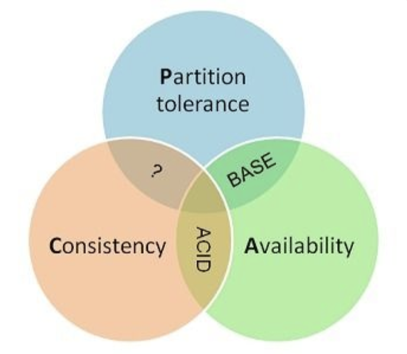

[toc]

## 1. 事务

### 1.1 概念

事务指的是满足 ACID 特性的一组操作，可以通过 Commit 提交一个事务，也可以使用 Rollback 进行回滚。

### 1.2. ACID

#### 1.2.1. 原子性（Atomicity）

事务被视为不可分割的最小单元，事务的所有操作要么全部提交成功，要么全部失败回滚。

回滚可以用回滚日志来实现，回滚日志记录着事务所执行的修改操作，在回滚时反向执行这些修改操作即可。

#### 1.2.2. 一致性（Consistency）

数据库在事务执行前后都保持一致性状态。在一致性状态下，所有事务对一个数据的读取结果都是相同的。

#### 1.2.3. 隔离性（Isolation）

一个事务所做的修改在最终提交以前，对其它事务是不可见的。

#### 1.2.4. 持久性（Durability）

一旦事务提交，则其所做的修改将会永远保存到数据库中。即使系统发生崩溃，事务执行的结果也不能丢失。

使用**重做日志**来保证持久性。

***

事务的 ACID 特性概念简单，但不是很好理解，主要是因为这几个特性不是一种平级关系：

- 只有满足**一致性**，事务的执行结果才是正确的。
- 在**无并发**的情况下，事务串行执行，隔离性一定能够满足。此时只要能满足**原子性**，就一定能满足一致性。
- 在**并发**的情况下，多个事务并行执行，事务不仅要满足**原子性**，还需要满足**隔离性**，才能满足一致性。
- 事务满足**持久性**是为了能应对数据库崩溃的情况。

### 1.3. MySQL处理并发的两种办法

#### 1.3.1 AUTOCOMMIT

MySQL 默认采用自动提交模式。也就是说，如果不显式使用`START TRANSACTION`语句来开始一个事务，那么每个查询都会被当做一个事务自动提交。

可以直接用 `SET` 来改变 MySQL 的自动提交模式:

- **SET AUTOCOMMIT=0**     禁止自动提交
- **SET AUTOCOMMIT=1**     开启自动提交

#### 1.3.2 手动提交

用 `BEGIN`, `ROLLBACK`, `COMMIT` 来实现

- **BEGIN**             开始一个事务
- **ROLLBACK**     事务回滚
- **COMMIT**         事务确认

## 2. 关系数据库设计理论

### 2.1. 函数依赖

- **函数依赖:** 记 $A\to B$ 表示 A 函数决定 B，也可以说 B **函数依赖**于 A。

  如果 {A1，A2，... ，An} 是关系的一个或多个属性的集合，该集合函数决定了关系的其它所有属性并且是最小的，那么该集合就称为**键码**。

- **平凡函数依赖&非平凡函数依赖：**对关系**$R(U)$**, $X$ 和 $Y$ 为属性集 $U$ 上的子集, 若 $X→Y$ 且 $X$ 不包含  $Y$, 则称 $X→Y$ 为**非平凡函数依赖**, 否则, 若 $X$ 包含 $Y$ 则必有 $X→Y$ , 称此 $X→Y$ 为**平凡函数依赖**。

- **完全函数依赖：**在一张表中，若 $X→Y$，且对于 $X$ 的任意一个真子集 $X^\prime$（假如属性组 $X$ 包含超过一个属性的话），$X’→Y$ 不成立，那么我们称 $Y$ 对于 $X$ **完全函数依赖**。

- **部分函数依赖：**假如 $Y$ 函数依赖于 $X$ ，但同时 $Y$ 并不完全函数依赖于$X$ ，那么我们就称 $Y$ **部分函数依赖**于 $X$ 。

- **传递函数依赖：**假如 $Z$ 函数依赖于 $Y$，且 $Y$ 函数依赖于 $X$，$Y$ 不包含于 $X$，且 $X$ 不函数依赖于  $Y$，那么我们就称 $Z$ **传递函数依赖**于 $X$。

- **多值依赖(Multi-valued Dependency)**：在一张表中，如果属性 $X$ 的值可以决定其他属性的一组值，那么属性 $X$ 和他可以决定的值之间就存在多值依赖。

  多值依赖具有对称性和传递性。函数依赖可以看作多值依赖的一种特殊情况。

- **连接依赖(Join Dependency)**：如果一张表总是可以通过多张表的`join`操作创建，那么表 $T$ 就服从连接依赖，其中多张表都包含 $T$ 的属性的子集。

### 2.2. 异常

以下的学生课程关系的函数依赖为 $\{Sno, Cname\} \to \{Sname, Sdept, Mname, Grade\}$，键码为 $\{Sno, Cname\}$。也就是说，确定学号和课程之后，就能确定其它信息。

| Sno  | Sname  | Sdept  | Mname  | Cname  | Grade |
| ---- | ------ | ------ | ------ | ------ | ----- |
| 1    | 学生-1 | 学院-1 | 院长-1 | 课程-1 | 90    |
| 2    | 学生-2 | 学院-2 | 院长-2 | 课程-2 | 80    |
| 2    | 学生-2 | 学院-2 | 院长-2 | 课程-1 | 100   |
| 3    | 学生-3 | 学院-2 | 院长-2 | 课程-2 | 95    |

不符合范式的关系，会产生很多异常，主要有以下四种异常：

- **冗余数据**：例如 `学生-2` 出现了两次。
- **修改异常**：修改了一个记录中的信息，但是另一个记录中相同的信息却没有被修改。
- **删除异常**：删除一个信息，那么也会丢失其它信息。例如删除了 `课程-1` 需要删除第一行和第三行，那么 `学生-1` 的信息就会丢失。
- **插入异常**：例如想要插入一个学生的信息，如果这个学生还没选课，那么就无法插入。

### 2.3. 范式

范式理论是为了解决以上提到四种异常。

高级别范式的依赖于低级别的范式，**1NF** 是最低级别的范式。

#### 2.3.1. 第一范式 (1NF)

要求属性具有原子性，属性不可分。

关系型数据库必须满足第一范式。第一范式是对属性的原子性约束。

#### 2.3.2. 第二范式 (2NF)

在第一范式基础上，一张表中不存在非主属性对键码的**部分函数依赖**。每个非主属性完全函数依赖于键码。

可以通过分解来满足。

**分解前**

| Sno  | Sname  | Sdept  | Mname  | Cname  | Grade |
| ---- | ------ | ------ | ------ | ------ | ----- |
| 1    | 学生-1 | 学院-1 | 院长-1 | 课程-1 | 90    |
| 2    | 学生-2 | 学院-2 | 院长-2 | 课程-2 | 80    |
| 2    | 学生-2 | 学院-2 | 院长-2 | 课程-1 | 100   |
| 3    | 学生-3 | 学院-2 | 院长-2 | 课程-2 | 95    |

以上学生课程关系中，{Sno, Cname} 为键码，有如下函数依赖：

- Sno -> Sname, Sdept
- Sdept -> Mname
- Sno, Cname-> Grade

Grade 完全函数依赖于键码，它没有任何冗余数据，每个学生的每门课都有特定的成绩。

Sname, Sdept 和 Mname 都部分依赖于键码，当一个学生选修了多门课时，这些数据就会出现多次，造成大量冗余数据。

**分解后**

**关系-1**

| Sno  | Sname  | Sdept  | Mname  |
| ---- | ------ | ------ | ------ |
| 1    | 学生-1 | 学院-1 | 院长-1 |
| 2    | 学生-2 | 学院-2 | 院长-2 |
| 3    | 学生-3 | 学院-2 | 院长-2 |

有以下函数依赖：

- Sno -> Sname, Sdept
- Sdept -> Mname

**关系-2**

| Sno  | Cname  | Grade |
| ---- | ------ | ----- |
| 1    | 课程-1 | 90    |
| 2    | 课程-2 | 80    |
| 2    | 课程-1 | 100   |
| 3    | 课程-2 | 95    |

有以下函数依赖：

- Sno, Cname -> Grade

#### 2.3.3. 第三范式 (3NF)

在第二范式基础之上，一张表中不存在非主属性对键码的**传递函数依赖**。

上面的 **关系-1** 中存在以下传递函数依赖：

- Sno -> Sdept -> Mname

可以进行以下分解：

| Sno  | Sname  | Sdept  |
| ---- | ------ | ------ |
| 1    | 学生-1 | 学院-1 |
| 2    | 学生-2 | 学院-2 |
| 3    | 学生-3 | 学院-3 |

| Sdept  | Mname  |
| ------ | ------ |
| 学院-1 | 院长-1 |
| 学院-2 | 院长-2 |

#### 2.3.4. 巴斯范式 (BCNF)

通常认为BCNF是修正的第三范式，有时也称为扩充的第三范式。BCNF需要满足条件：

1. 所有非主属性对每一个候选键都是完全函数依赖
2. 所有的主属性对每一个不包含它的候选键，也是完全函数依赖
3. 没有任何属性完全函数依赖于非候选键的任何一组属性

#### 2.3.5. 第四范式 (4NF)

满足3NF，消除表中的非平凡且非函数依赖的**多值依赖。**

------

一般情况下，数据库设计满足三范式就可以，甚至为了在十分复杂的数据库里为了提升效率，要做到**逆范式**。

在结构规范化、减少数据冗余和提高数据库访问性能之间仔细权衡，适当折中。

## 3. 非关系型数据库设计理论

非关系型数据库库通常称为NoSQL(Not Only SQL)。

在NoSQL的发展过程中有三块基石 — **CAP**，**BASE**和**最终一致性**。而5分钟法则展示了管理内存数据的理论基础。

### 3.1 CAP

- C: **一致性** Consitency 等同于所有节点访问同一份最新的数据副本
- A: **可用性** Availability 每次请求都能获取到非错的响应——但是不保证获取的数据为最新数据
- P: **分区容错性** Tolerance of network Partition 大多数分布式系统都分布在多个子网络。每个子网络就叫做一个区（partition）。 分区容错的意思是，区间通信可能失败。比如，一台服务器放在中国，另一台服务器放在美国，这就是两个区，它们之间可能无法通信。

**CAP理论**告诉我们，一个分布式系统不可能满足**一致性**，**可用性**和**分区容错性**这三个需求，最多只能同时满足两个。

一般来说，分区容错无法避免，因此可以认为 CAP 的 P 总是成立。CAP 定理告诉我们，剩下的 C 和 A 无法同时做到。

作为架构师，一般有两个方向来利用CAP理论。

- key-value存储，如Amaze Dynamo等，可根据CAP三原则灵活选择不同倾向的数据库产品。 领域模型 + 分布式缓存 + 存储 （Qi4j和NoSql），可根据CAP三原则结合自己项目定制灵活的分布式方案，难度高。
- 对大型网站，可用性与分区容忍性优先级要高于数据一致性，一般会尽量朝着 A、P 的方向设计，然后通过其它手段保证对于一致性的商务需求。架构设计师不要精力浪费在如何设计能满足三者的完美分布式系统，而是应该进行取舍。

不同数据对于一致性的要求是不同的。

举例来讲，用户评论对不一致是不敏感的，可以容忍相对较长时间的不一致，这种不一致并不会影响交易和用户体验。而产品价格数据则是非常敏感的，通常不能容忍超过10秒的价格不一致。

### 3.2. 最终一致性

一言蔽之：过程松，结果紧，最终结果必须保持一致性 为了更好的描述客户端一致性，我们通过存储系统的例子来开展描述， 存储系统可以理解为一个黑盒子，它为我们提供了可用性和持久性的保证。Process A, B, C, 相互独立， 同时实现对存储系统的write和read操作。

下面以上面的场景来描述下不同程度的一致性：

- **强一致性**（即时一致性）

  假如A先写入了一个值到存储系统，存储系统保证后续A,B,C的读取操作都将返回最新值

- **弱一致性**

  假如A先写入了一个值到存储系统，存储系统不能保证后续A,B,C的读取操作能读取到最新值。此种情况下有一个“不一致性窗口”的概念，它特指从A写入值，到后续操作A,B,C读取到最新值这一段时间。

- **最终一致性** 最终一致性是弱一致性的一种特例。假如A首先write了一个值到存储系统，存储系统保证如果在A,B,C后续读取之前没有其它写操作更新同样的值的话，最终所有的读取操作都会读取到最A写入的最新值。此种情况下，如果没有失败发生的话，“不一致性窗口”的大小依赖于以下的几个因素：交互延迟，系统的负载，以及复制技术中replica的个数（这个可以理解为master/salve模式中，salve的个数），最终一致性方面最出名的系统可以说是DNS系统，当更新一个域名的IP以后，根据配置策略以及缓存控制策略的不同，最终所有的客户都会看到最新的值。

- **Causal consistency（因果一致性）**

  如果Process A通知Process B它已经更新了数据，那么Process B的后续读取操作则读取A写入的最新值，而与A没有因果关系的C则可以最终一致性。

- **Read-your-writes consistency**

  如果Process A写入了最新的值，那么Process A的后续操作都会读取到最新值。但是其它用户可能要过一会才可以看到。

- **Session consistency**

  此种一致性要求客户端和存储系统交互的整个会话阶段保证Read-your-writes consistency.Hibernate的session提供的一致性保证就属于此种一致性。

- **Monotonic read consistency**

  此种一致性要求如果Process A已经读取了对象的某个值，那么后续操作将不会读取到更早的值。

- **Monotonic write consistency**

  此种一致性保证系统会序列化执行一个Process中的所有写操作。

### 3.3. BASE

BASE模型反ACID模型，完全不同ACID模型，牺牲高一致性，获得可用性或可靠性：

#### 3.3.1. 基本可用（Basically Available）

Basically Available基本可用。支持分区失败(e.g. sharding碎片划分数据库)

#### 3.3.2. 软状态/柔性事务（Soft state）

"Soft state" 可以理解为"无连接"的, 而 "Hard state" 是"面向连接"的。软状态，即状态可以有一段时间不同步，异步。

#### 3.3.3. 最终一致性（Eventual Consistency）

最终一致性， 也是是 ACID 的最终目的。最终数据是一致的就可以了，而不是时时一致。

BASE思想的主要实现有

1. 按功能划分数据库
2. sharding碎片

BASE思想主要强调基本的可用性，如果你需要高可用性，也就是纯粹的高性能，那么就要以一致性或容错性为牺牲，BASE思想的方案在性能上还是有潜力可挖的。

### 3.2. **I/O的五分钟法则**

简而言之，如果一条记录频繁被访问，就应该放到内存里，否则的话就应该待在硬盘上按需要再访问。这个临界点就是五分钟。

看上去像一条经验性的法则，实际上五分钟的评估标准是根据投入成本判断的，根据当时的硬件发展水准，在内存中保持 1KB 的数据成本相当于硬盘中存据 400 秒的开销(接近五分钟)。这个法则在 1997 年左右的时候进行过一次回顾，证实了五分钟法则依然有效（硬盘、内存实际上没有质的飞跃)，而这次的回顾则是针对 SSD 这个"新的旧硬件"可能带来的影响。

随着闪存时代的来临，五分钟法则一分为二：是把 SSD 当成较慢的内存（extended buffer pool ）使用还是当成较快的硬盘（extended disk）使用。小内存页在内存和闪存之间的移动对比大内存页在闪存和磁盘之间的移动。在这个法则首次提出的 20 年之后，在闪存时代，5 分钟法则依然有效，只不过适合更大的内存页(适合 64KB 的页，这个页大小的变化恰恰体现了计算机硬件工艺的发展，以及带宽、延时)。

## 4. ER 图

Entity-Relationship，有三个组成部分：实体、属性、联系。

用来进行关系型数据库系统的概念设计。

### 4.1 实体的三种联系

包含一对一，一对多，多对多三种。

- 如果 A 到 B 是一对多关系，那么画个带箭头的线段指向 B；
- 如果是一对一，画两个带箭头的线段；
- 如果是多对多，画两个不带箭头的线段。

下图的 Course 和 Student 是一对多的关系。

### 4.2 表示出现多次的关系

一个实体在联系出现几次，就要用几条线连接。

下图表示一个课程的先修关系，先修关系出现两个 Course 实体，第一个是先修课程，后一个是后修课程，因此需要用两条线来表示这种关系。

### 4.3 联系的多向性

虽然老师可以开设多门课，并且可以教授多名学生，但是对于特定的学生和课程，只有一个老师教授，这就构成了一个三元联系。

