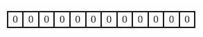
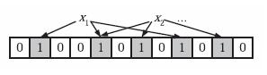
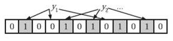

[toc]

## 一、什么是Bloom Filter

Bloom Filter是一种空间效率很高的随机数据结构。

它的原理是，当一个元素被加入集合时，通过**K个Hash函数**将这个元素映射成一个 **Bit array** 中的**K**个点，把它们置为1。 检索时，我们只要看看这些点是不是都是1就（大约）知道集合中有没有它了：如果这些点有任何一个0，则被检索元素一定不在；如果都是1，则被检索元素很可能在。这就是布隆过滤器的基本思想。

但Bloo Filter的这种高效是有一定代价的：在判断一个元素是否属于某个集合时，有可能会把不属于这个集合的元素误认为属于这个集合（false positive）。因此，Bloom Filter**不适合**那些“**零错误**”的应用场合。而在能容忍低错误率的应用场合下，Bloom Filter通过极少的错误换取了存储空间的极大节省。

**Bloom Filter** 也被译作**布隆过滤器**。

### 1.1. 集合表示和元素查询

下面我们具体来看Bloom Filter是如何用位数组表示集合的。

初始状态时，Bloom Filter是一个包含m位的位数组，每一位都置为0。

为了表达 $S={x1, x2,…,xn}$ 这样一个 n 个元素的集合，Bloom Filter 使用 k 个相互独立的哈希函数，它们分别将集合中的每个元素映射到 $\{1,…,m\}$ 的范围中。对任意一个元素 x，第 i 个哈希函数映射的位置 $hi(x)$ 就会被置为1（1≤i≤k）。注意，如果一个位置多次被置为1，那么只有第一次会起作用，后面几次将没有任何效果。在下图中，k=3，且有两个哈希函数选中同一个位置（从左边数第五位，即第二个“1“处）。

在判断y是否属于这个集合时，我们对y应用k次哈希函数，如果所有hi(y)的位置都是1（1≤i≤k），那么我们就认为y是集合中的元素，否则就认为y不是集合中的元素。下图中y1就不是集合中的元素（因为y1有一处指向了“0”位）。y2或者属于这个集合，或者刚好是一个false positive

### 1.2. 错误率估计

前面我们已经提到了，Bloom Filter在判断一个元素是否属于它表示的集合时会有一定的错误率（false positive rate），下面我们就来估计错误率的大小。

在估计之前为了简化模型，我们假设 $k·n$ 且各个哈希函数是完全随机的。当集合 $S={x1, x2,…,xn}$ 的所有元素都被 k 个哈希函数映射到 m 位的 Bit Array 中时，这个位数组中某一位还是0的概率是：
$$
p^\prime=\big(1-\frac{1}{m}\big)^{kn}\simeq e^{-\frac{kn}{m}}
$$
其中 $1/m$ 表示任意一个哈希函数选中这一位的概率（前提是哈希函数是完全随机的），$(1-1/m)$ 表示哈希一次没有选中这一位的概率。

要把 $S$ 完全映射到位数组中，需要做 $k·n$ 次哈希。某一位还是0意味着$kn$次哈希都没有选中它，因此这个概率就是$（1-1/m）$的 $kn$ 次方。令 $p = e-kn/m$ 是为了简化运算，这里用到了计算e时常用的近似：
$$
\lim_{x\to\infty}\big(1-\frac{1}{x}\big)^{-x}=e
$$
令 $ρ$  为位数组中0的比例，则 $ρ$ 的数学期望 $E(ρ)= p’$。在 $ρ$ 已知的情况下，要求的错误率（false positive rate）为：
$$
(1-\rho)^k\simeq(1-p^\prime)^k\simeq(1-p)^k
$$
$(1-ρ)$ 为位数组中 1 的比例，$(1-ρ)^k$ 就表示 $k$ 次哈希都刚好选中 1 的区域，即false positive rate。上式中第二步近似在前面已经提到了，现在来看第一步近似。$p’$只是 $ρ$ 的数学期望，在实际中ρ的值有可能偏离它的数学期望值。*M. Mitzenmacher*已经证明 ，位数组中0的比例非常集中地分布在它的数学期望值的附近。因此，第一步的近似得以成立。分别将$p$和$p’$代入上式中，得：
$$
f^\prime=\bigg(1-\big(1-\frac{1}{m}\big)^{kn}\bigg)^k=(1-p^\prime)^k
$$

$$
f=(1-e^{-\frac{kn}{m}})^k=(1-p)^k
$$

相比$p’$和$f’$，使用$p$和$f$通常在分析中更为方便。

### 1.3. 最优的哈希函数个数

既然Bloom Filter要靠多个哈希函数将集合映射到位数组中，那么应该选择几个哈希函数才能使元素查询时的错误率降到最低呢？

这里有两个互斥的理由：

- 如果哈希函数的个数多，那么在对一个不属于集合的元素进行查询时得到0的概率就大；
- 如果哈希函数的个数少，那么位数组中的0就多。

为了得到最优的哈希函数个数，我们需要根据上一小节中的错误率公式进行计算。

先用p和f进行计算。注意到 $f = exp(k\ ln(1 − e^{−kn/m}))$，我们令 $g = k\ ln(1 − e^{−kn/m})$，只要让$g$取到最小，$f$自然也取到最小。由于$p = e^{-kn/m}$，我们可以将$g$写成
$$
g=-\frac{m}{n}\ ln(p)\ ln(1-p)
$$
根据对称性法则可以很容易看出当$p = 1/2$，也就是$k = ln2· (m/n)$时，$g$取得最小值。在这种情况下，最小错误率$f$等于$(1/2)k≈ (0.6185)m/n$。另外，注意到$p$是位数组中某一位仍是0的概率，所以$p = 1/2$对应着位数组中0和1各一半。换句话说，要想保持错误率低，最好让位数组有一半还空着。

需要强调的一点是，$p = 1/2$时错误率最小这个结果并不依赖于近似值 $p$ 和 $f$。同样对于$f’ = exp(k\ ln(1 − (1 − 1/m)^{kn}))$，$g’ = k\ ln(1 − (1 − 1/m)^{kn})$，$p’ = (1 − 1/m)^{kn}$，我们可以将$g’$写成
$$
g^\prime=\frac{1}{n\ ln(1-1/m)}ln(p^\prime)ln(1-p^\prime)
$$
同样根据对称性法则可以得到当$p’ = 1/2$时，$g’$取得最小值。

综上，当哈希函数个数 $k = ln2· (m/n)$ 时错误率最低。

### 1.4. 位数组的大小

下面我们来看看，在不超过一定错误率的情况下，Bloom Filter至少需要多少位才能表示全集中任意$n$个元素的集合。假设全集中共有$u$个元素，允许的最大错误率为 $\epsilon$，下面我们来求位数组的位数 $m$。

假设X为全集中任取n个元素的集合，$F(X)$是表示X的位数组。那么对于集合X中任意一个元素 $x$，在$s = F(X)$中查询$x$都能得到肯定的结果，即$s$能够接受$x$。显然，由于Bloom Filter引入了错误，s能够接受的不仅仅是X中的元素，它还能够$є (u - n)$个false positive。因此，对于一个确定的位数组来说，它能够接受总共 $n + є (u - n)$ 个元素。在$n + є (u - n)$个元素中，$s$真正表示的只有其中$n$个，所以一个确定的位数组可以表示$C^n_{n+є(u - n)}$个集合。$m$位的位数组共有$2m$个不同的组合，进而可以推出，$m$位的位数组可以表示$2^m\times C^n_{n+ є (u - n)}$ 个集合。全集中n个元素的集合总共有 $C^u_n$ 个，因此要让$m$位的位数组能够表示所有$n$个元素的集合，必须有$2^m\times C^n_{n+ є (u - n)} ≥ C^u_n$, 即：
$$
m\ge log_2\frac{C_u^n}{C_{n+ є (u - n)}^n}\simeq log2\frac{C_u^n}{C^n_{єu}}\ge log_2\epsilon^{-n}=nlog_2\frac{1}{\epsilon}
$$
上式中的近似前提是$n$和$єu$相比很小，这也是实际情况中常常发生的。根据上式，我们得出结论：在错误率不大于$є$的情况下，$m$至少要等于$n\ log2(1/є)$才能表示任意n个元素的集合。

上一小节中我们曾算出当$k = ln2· (m/n)$时错误率$f$最小，这时$f = (1/2)^k= (1/2)^{\frac{m\ ln2}{n}}$。现在令$f≤є$，可以推出
$$
m\ge n\frac{log_2\frac{1}{\epsilon}}{ln\ 2}=nlog_2\frac{1}{\epsilon}log_2 e
$$
这个结果比前面我们算得的下界$n\ log2(1/є)$大了$log2e≈ 1.44$倍。这说明在哈希函数的个数取到最优时，要让错误率不超过$є$，$m$至少需要取到最小值的1.44倍。

### 1.5. 概括

在计算机科学中，我们常常会碰到时间换空间或者空间换时间的情况，即为了达到某一个方面的最优而牺牲另一个方面。Bloom Filter在时间空间这两个因素之外又引入了另一个因素：错误率。在使用Bloom Filter判断一个元素是否属于某个集合时，会有一定的错误率。也就是说，有可能把不属于这个集合的元素误认为属于这个集合（False Positive），但不会把属于这个集合的元素误认为不属于这个集合（False Negative）。在增加了错误率这个因素之后，Bloom Filter通过允许少量的错误来节省大量的存储空间。

自从Burton Bloom在70年代提出Bloom Filter之后，Bloom Filter就被广泛用于**拼写检查**和数据库系统中。近一二十年，伴随着网络的普及和发展，Bloom Filter在网络领域获得了新生，各种Bloom Filter变种和新的应用不断出现。可以预见，随着网络应用的不断深入，新的变种和应用将会继续出现，Bloom Filter必将获得更大的发展。

## 二、适用范围

可以用来实现数据字典，进行数据的判重，或者集合求交集

## 三、基本原理及要点

对于原理来说很简单，位数组 +k 个独立 hash函数。将 hash函数对应的值的位数组置1，查找时如果发现所有hash函数对应位都是1说明存在，很明显这个过程并不保证查找的结果是100%正确的。同时也不支持删除一个已经插入的关键字，因为该关键字对应的位会牵动到其他的关键字。所以一个简单的改进就是 counting Bloom filter，用一个counter数组代替位数组，就可以支持删除了。

还有一个比较重要的问题，如何根据输入元素个数n，确定位数组m的大小及hash函数个数。

当 hash函数个数 $k=(ln2)(m/n)$时错误率最小。在错误率不大于E的情况 下，m至少要等于$nlg(1/E)$才能表示任意n个元素的集合。但m还应该更大些，因为还要保证bit数组里至少一半为0，则 $m$ 应该大于等于 $nlg(1/E)\times lg\ e$ 大概就是 $nlg(1/E)$ 的$1.44$ 倍 (lg表示以2为底的对数)。

举个例子我们假设错误率为0.01，则此时m应大概是n的13倍。这样k大概是8个。

注意这里m与n的单位不同，m是bit为单位，而n则是以**不同**元素的个数为单位。通常单个元素的长度都是有很多bit的。所以使用bloom filter内存上通常都是节省的。

## 四、扩展

Bloom filter将集合中的元素映射到位数组中，用k（k为哈希函数个数）个映射位是否全1表示元素在不在这个集合中。Counting bloom filter（CBF）将位数组中的每一位扩展为一个counter，从而支持了元素的删除操作。Spectral Bloom Filter（SBF）将其与集合元素的出现次数关联。SBF采用counter中的最小值来近似表示元素的出现频率。

## 五、问题实例

**给你A,B两个文件，各存放50亿条URL，每条URL占用64字节，内存限制是4G，让你找出A,B文件共同的URL。如果是三个乃至n个文件呢？**

根据这个问题我们来计算下内存的占用，4G=2^32大概是40亿*8大概是340亿，n=50亿，如果按出错率0.01算需要的大概是650亿个bit。 现在可用的是340亿，相差并不多，这样可能会使出错率上升些。另外如果这些url ip是一一对应的，就可以转换成ip，则大大简单了。