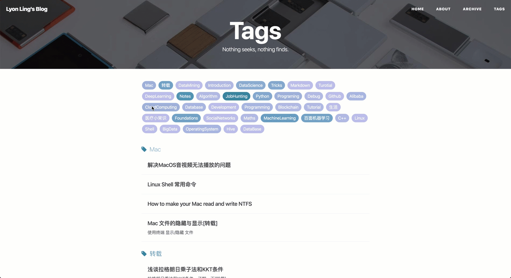

沉寂了秋招的两个多月, 终于再次重新启动了个人博客的项目😅, 又可以开始学习了呢🙃.

这次重启, 相比旧的版本, 首先纠正了以前posts因为tag格式不够规范引起的`YML`文件头丢失的BUG, 然后参考其他优秀的博客框架, 对原来的博客框架做出了一些调整和优化, 也引入了一些新的功能, 大概如下.

### 1. 新功能引入

在茫茫多的 [Jekyll 主题](http://jekyllthemes.org/)中我挑中了 [kitian616](https://github.com/kitian616) 的 [[**TeXt**](https://tianqi.name/jekyll-TeXt-theme/)] 和 [Huangxuan]() 的 [[**HuxPro**](https://github.com/Huxpro/huxpro.github.io)]. 原因很简单, 这两款主题风格都非常简单好看, 然后对 Markdown 语法和内嵌 LaTeX 支持良好, 然后也有一些细节上的特性和小功能非常有趣.

最终, 因为更熟悉中意 **HuxPro** 的风格, 这里基于 Hux 提供的 Boilerplate 进行了一次简单的二次定制, 加入了一些 TeXt 上看到的小功能.

#### Post 分享功能

首先是引入了**TeXt**主题中使用的分享功能 -- [**AddThis**](https://www.addthis.com/). 现在每篇Post都可以通过右下角的小图标做快捷分享.


#### 站内搜索

然后, 相比**TeXt**和**JeKyll**的主流主题**Next**, **HuxPro**的一个小缺陷是没有站内搜索功能, 当以后Post比较多的时候, 只通过Tag分类来查找的方法就显得有点不够效率. 

因此, 这里我通过 [**Simple-Jekyll-Search**](https://github.com/christian-fei/Simple-Jekyll-Search) 模块, 实现了一个简单的在侧边栏的站内模糊搜索.


### 2. 旧版细节优化

因为之前是参考基于 HuxPro 搭建的 [BY Blog](https://github.com/qiubaiying/qiubaiying.github.io), 然后自己也添加了点不成熟的修改, 最终导致出现一些小问题没有解决.

#### 代码块高亮

之前的版本中, 代码块只能以 plain text 显示, 无法根据对应语言自动高亮. 现在修复了这个Bug. 未来还有想法实现对多种代码高亮风格的支持. (目前这样黑色也挺好看的, 不是我懒~

#### Archive 界面的优化

之前是通过页面的锚去做直接滚动, 新版本则是直接去做异步跳转. 使用起来应该会更方便一些. 
直接看效果图.

**Old Version:**



**New Version:**


### 3. Post Tag 设计规则

本身我搭建这个博客的目的就是一方面鼓励自己坚持学习, 另一方面通过博客框架的自动标签功能实现快速多分类, 以便于知识内容的管理和快速回顾. 但是使用几个月之后发现, 当post变多之后, 之前草率定下的标签就会出现冗余和混乱.

因此在新的版本, 我制定了一个标签设定规则并且重新整理了过去所有post的标签. 具体规则我会在 [**About**](https://lyonling.github.io/about/) 保持更新, 内容如下:

根据post所属领域和相关内容, tag以多级形式排列. 其中第0级属于标签分类, 不做实际用途.
此外, 所有标签以驼峰法命名, 当post中提到低级tag时, 其对应的父级tag也需要在前面提到.

```pseudocode
- 编程语言
  - Python
  - C++
  - Java
  - JavaScript
  - Shell
  - MarkDown
- 计算机基础
  - OperatingSystem
    - Mac
    - Linux
    - Windows
  - ComputerNetworks
  - Database
  - Algorithm
- 大数据 & 数据科学
  - Maths
  - MachineLearning
  - SocialNetworks
  - NLP
  - DataMining
  - BigData
	  - Spark
- 工具 & 框架
  - Github
  - Hive
  - BlockChain
- 抽象类别
  - Foundation
  - Tutorial
  - Tricks				# 小技巧
  - Anouncement		# Blog的一些公告
  - Debug					# 写程序时遇到的坑&Debug的经验
  - Experience		# 一些形如面经这类的经验内容
  - Notes					# 读书笔记
  - 医疗常识
  - 转载
- 企业相关
	- Alibaba
- 专栏						# 读书笔记, 系统性主题复习等等
  - 百面机器学习
  - 谷歌方法论			# 吴军老师的 谷歌方法论 & 硅谷来信 系列内容阅读笔记
	- JobHunting
```


在post里, 高级别的tag应该置于低级别的tag之前, 一篇post中的tag数量最好不要超过5个 (多了容易出现丢失YML头的BUG, 暂时不知道为啥...). 