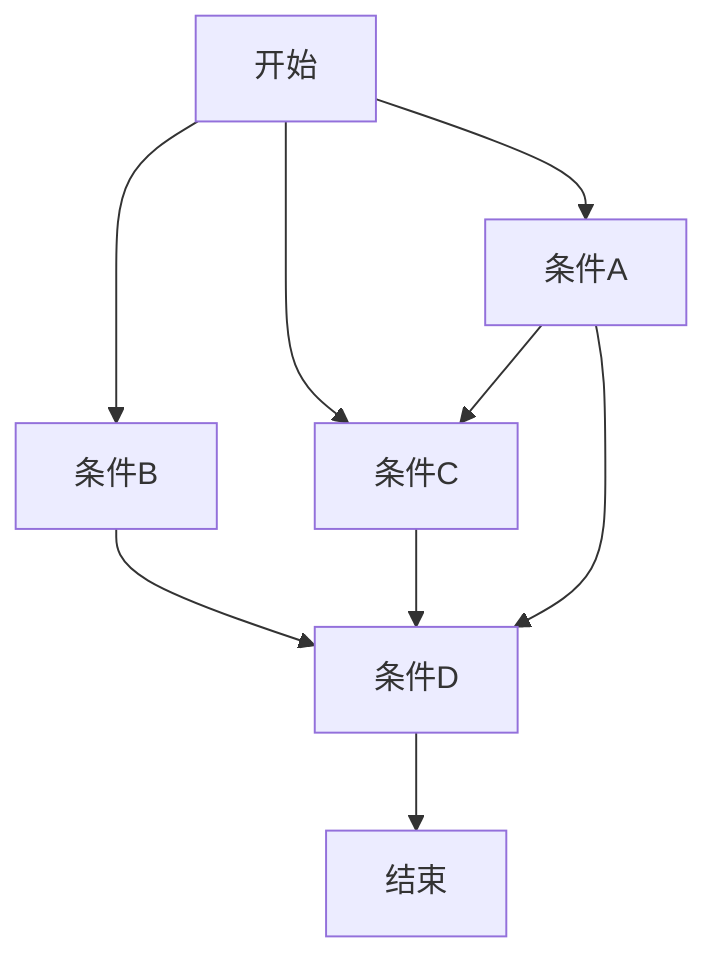
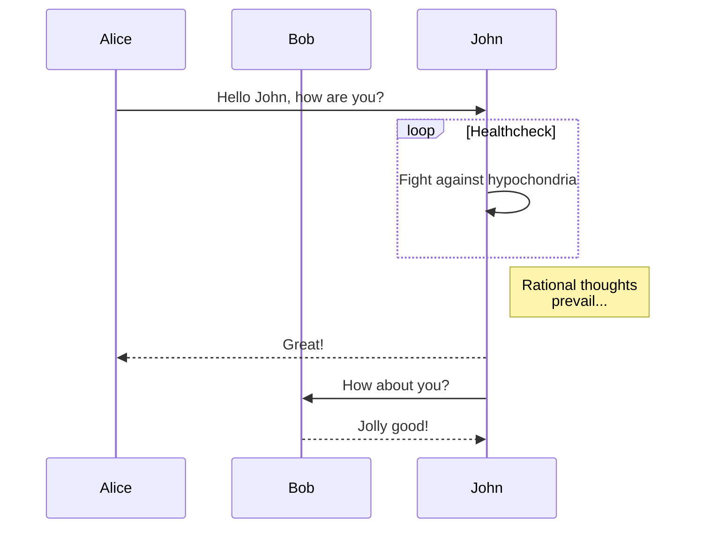
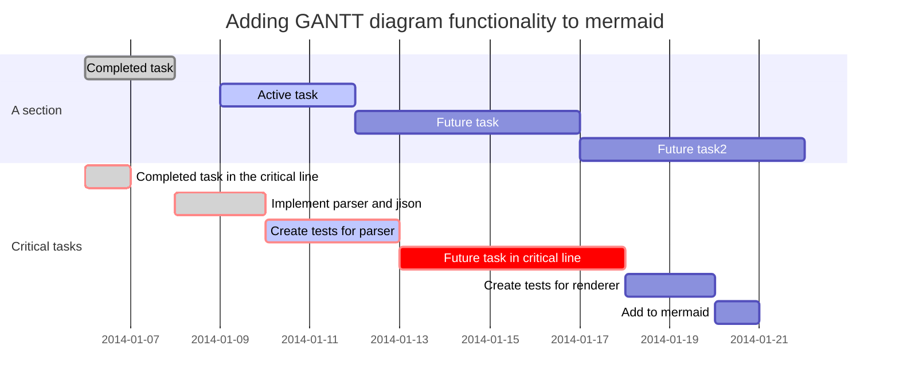
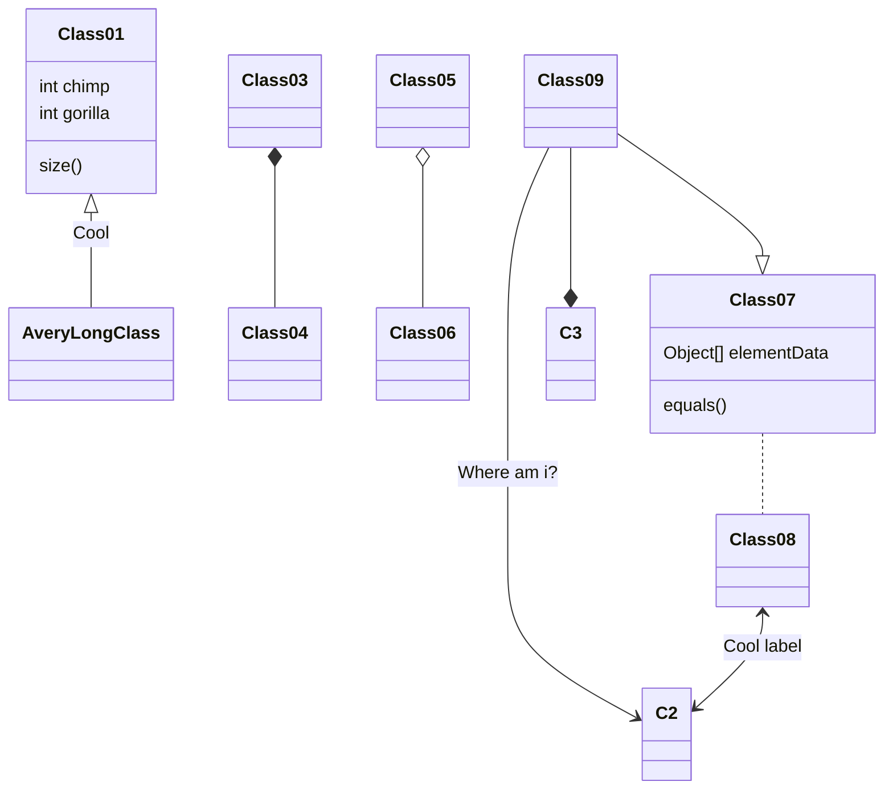

# Typora for Markdown 语法

### 前言

> **Markdown** 是一种**轻量级**标记语言，创始人是**约翰·格鲁伯**（John Gruber）。它允许人们 “使用易读易写的纯文本格式编写文档，然后转换成有效的 HTML 文档。

#### Typora

Typora是一款轻量级的Markdown 编辑器，重点在于所见即所得，与传统的两段显示不同，其极简的界面很受推崇。

这边简单介绍一下Typora上支持的markdown语法，因为这个博客markdown解析引擎的不同，有些语法不能很好的在博文里展现效果，感兴趣的话可以放到typora里尝试。

### 目录列表Table of Contents（TOC）

输入[toc]然后回车，将会产生一个目录，这个目录抽取了文章的所有标题，自动更新内容。

### **标题**

使用#表示一级标题，##表示二级标题，以此类推，有6个标题。

`Ctrl 0` 到 `Ctrl 6`：普通文本、一级～六级标题；

```markdown
# 1
## 1
```

### 加粗

`Ctrl B`：加粗，**加粗测试**；

### 斜体

`Ctrl I`：斜体，*斜体测试*；在标准的Markdown语法中，

*和_包裹的内容会是斜体显示，但是GFM下划线一般用来分隔人名和代码变量名，因此我们推荐是用星号来包裹斜体内容。如果要显示星号，则使用转义：

```
\* 
```

eg. *这是斜体*

### 下划线

`Ctrl U`：下划线，<u>下划线测试</u>；

用HTML的语法`<u>Underline</u>`将产生下划线 Underline.

### 强调（高亮）

```
本节课重点：==第六、七章不考==，第三章出题较多，==平时分占 30%==
```

本节课重点：==第六、七章不考==，第三章出题较多，==平时分占 30%==

### 删除线

`Shift Alt 5`：删除线，~~删除线测试~~；

GFM添加了删除文本的语法，这是标准的Markdown语法木有的。使用`~~`包裹的文本将会具有删除的样式。

### 代码块

`Shift Ctrl Tab键上面那个键 `：行内代码块，`行内代码块测试`；

- 使用`包裹的内容将会以代码样式显示，例如

```
使用`printf()`
```

则会产生`printf()`样式。

- 输入`~~~`或者```然后回车，可以输入代码块，并且可以选择代码的语言。例如：

```python
 public Class HelloWorld{
   System.out.println("Hello World!");
 }
```

### 超链接

`Ctrl K`：超链接，[超链接测试](www.baidu.com)；还支持文章内锚点，请 `Ctrl ` 点击此处 :arrow_right: [第二节](#基本的不带快捷键 Markdown 书写演示)；

使用尖括号包裹的url将产生一个连接，例如：`<www.baidu.com>`将产生连接: .

如果是标准的url，则会自动产生连接，例如: 。

关于链接：英文输入下的中括号，里面填上你想写的话，然后在后面输入小括号里面贴上链接地址就可以了 ，它的快捷键是`Ctrl+K` 。

例如： `[百度一下](www.baidu.com)` 就可以变成 [百度一下](www.baidu.com)


### 表格

```
|姓名|性别|毕业学校|工资|
|:---|:---:|:---:|---:|
|杨洋|男|重庆交通大学|3200|
|峰哥|男|贵州大学|5000|
|坑货|女|北京大学|2000|
```

将产生:

| 姓名 | 性别 | 毕业学校     | 工资 |
| ---- | ---- | ------------ | ---- |
| 杨洋 | 男   | 重庆交通大学 | 3200 |
| 峰哥 | 男   | 贵州大学     | 5000 |
| 坑货 | 女   | 北京大学     | 2000 |

其中代码的第二行指定对齐的方式，第一个是左对齐，第二个和第三个是居中，最后一个是右对齐。

事实上，通过右键–>insert的形式打开的，当然也可以通过快捷键Ctrl+T来打开。填入行数与列数就可以了 。

==也可以用第三方库代入代码比如[LaTex表格https://www.tablesgenerator.com/](https://www.tablesgenerator.com/)==

[https://www.truben.no/table/](https://www.truben.no/table/)


下面就是我拷贝过来的代码式样

|      |      |      |      |      |
| ---- | ---- | ---- | ---- | ---- |
|      |      |      |      |      |
|      |      |      |      |      |
|      |      |      |      |      |


### 引用

`Ctrl Shift Q`：引用：

> 我需要三件东西：爱情、友谊和图书。然而这三者之间何其相通！
>
> 炽热的爱情可以充实图书的内容，图书又是人们最忠实的朋友。
>
> —— 蒙田

使用>来插入块引用。例如：

```
>这是一个块引用！
```

将产生：

> 这是一个块引用！

### 插入图片

`Shift Ctrl I`：图片：

我们可以通过拖拉的方式，将本地文件夹中的图片或者网络上的图片插入。


https://lyonling.github.io/2019/01/05/Typora-Markdown%E8%AF%AD%E6%B3%95/www.baidu.com)

### 数学公式

要启用这个功能，首先到`Preference`->`Editor`中启用。`Shift Ctrl M`：公示块，快捷输入 LeTex 公式：

然后使用`$`符号包裹Tex命令，

例如：`$lim_{x \to \infty} \ exp(-x)=0$`将产生如下的数学表达式：

​                             $lim_{x \to \infty} \ exp(-x)=0$

输入两个`$`符号，然后回车，就可以输入==数学表达式块==了。例如：

```
 $$\mathbf{V}_1 \times \mathbf{V}_2 =  \begin{vmatrix} \mathbf{i} & \mathbf{j} & \mathbf{k} \\\frac{\partial X}{\partial u} &  \frac{\partial Y}{\partial u} & 0 \\\frac{\partial X}{\partial v} &  \frac{\partial Y}{\partial v} & 0 \\\end{vmatrix}$$
```

将会产生:

$$\mathbf{V}_1 \times \mathbf{V}_2 =  \begin{vmatrix} \mathbf{i} & \mathbf{j} & \mathbf{k} \\\frac{\partial X}{\partial u} &  \frac{\partial Y}{\partial u} & 0 \\\frac{\partial X}{\partial v} &  \frac{\partial Y}{\partial v} & 0 \\\end{vmatrix}​$$

关于更详细的LaTeX公式，可以参考[这篇博客](http://blog.163.com/goldman2000@126/blog/static/167296895201221242646561/)

==小技巧==     可以运用第三方库或者软件迅速得到公式的代码，比如MathType Axmath [lyx](https://www.lyx.org/Home)就可以LaTex或者markdown代码


### 代码块

代码块（我居然不能转义那个字符，就 Tab 键上面那个）：三个飘号键

```
​```
```

```python
#!/usr/bin/python3
import os
with open('List.txt', 'w') as f:
	for i in range(10):
		f.writelines(str(i))  
	print('成功写入数列')
os.system('rm ./List.txt')
print('成功删除文件')
```

### 列表

输入+, -, *,(+空格)创建无序的列表，使用任意数字开头，创建有序列表，例如：

```
**无序的列表**
* tfboys
* 杨洋
* 我爱你
```

**无序的列表**

- tfboys
- 杨洋
- 我爱你

```
**有序的列表**
1. 苹果
6. 香蕉
10. 我都不喜欢
```

**有序的列表**

1. 苹果
2. 香蕉
3. 我都不喜欢

### 任务列表

使用如下的代码创建任务列表，在[]中输入x表示完成，也可以通过点击选择完成或者没完成。

```
- [ ] 吃饭
- [x] 逛街
- [ ] 看电影
- [ ] 约泡
```

- 吃饭
- 逛街
- 看电影
- 约泡

### 参考链接：

​	通过培养试验研究了有机酸对铅、镉的毒害影响，结果表明柠檬酸对铅[^1]，酒石酸对镉有较明显解毒作用[^2]。用逐步提取法研究萝卜根叶内重金属存在的化学形态 ，有机酸处理并不影响各形态铅的优势顺序 ，但各形态铅的浓度或相对百分率发生了变化。

[^1]: 陈苏. 污染土壤中镉、铅的活化及植物有效性研究[D]. 中国科学院沈阳应用生态研究所, 2007.
[^2]: 陈英旭, 林琦, 陆芳,等. 有机酸对铅、镉植株危害的解毒作用研究[J]. 环境科学学报, 2000, 20(4):467-472.

### 

### 上下标

下标使用`~`包裹，例如：`H~2~O`将产生水的分子式。

   H~2~O    

上标使用`^`包裹，例如：`y^2^=4`将产生表达式 。

​        y^2^=4

```markdown
下标使用`~`包裹，例如：`H~2~O`将产生水的分子式。 

​              H~2~O

上标使用`^`包裹，例如：`y^2^=4`将产生表达式 。

​            y^2^=4
```

### 标注(注释)

我们可以对某一个词语进行标注。例如

```
<!--这一段不要显示出来-->
```

<!--这一段不要显示出来-->

```
某些人用过了才知道[^注释]
[^注释]:Somebody that I used to know.
```

将产生：

某些人用过了才知道[^注释]

把鼠标放在`注释`上，将会有提示内容。

### 水平分割线

使用`***`或者`---`，然后回车，来产生水平分割线。

### 插入表情

使用`:happy:`输入高兴的表情，使用`:sad:`输入悲伤的表情，使用`:cry:`输入哭的表情等。以此类推！

:happy::cry: :weary:


### 

使用两个*号或者两个_包裹的内容将会被强调。例如

```
**使用两个*号强调内容**
__使用两个下划线强调内容__
```

将会输出

**使用两个*号强调内容** **使用两个下划线强调内容** Typora 推荐使用两个*号。


### 绘图

几何画板

geogebra

Adobe illustrator

matlab

mathmaticas


### 常用快捷键

==备注==`:飘号键在tap键的上方

​         ~:`按住shift键和tap上面的键`

标题：`ctrl+0到ctrl+6` 

​         #空格+文字 ，回车即可

加粗：`Ctrl+B`

斜体：`Ctrl+I`

​      *哈哈哈哈*

字体：`Ctrl+数字`

下划线：`Ctrl+U`

删除线：`shift+alt+5`

​       ~~删除线~~

返回开头：`Ctrl+Home`

返回结尾：`Ctrl+End`

生成表格：`Ctrl+T`

创建链接：`Ctrl+K`

​     [百度](https://www.baidu.com/)`访问可以按住ctrl点击`

插入：`shift+ctrl+tap键上面那个键`

引用：`ctrl+shift+Q`

> ​        hhh

图片：`shift+ctrl+I`

​     

​    插入公式：`shift+ctrl+m`

​               
$$
limhh
$$

### 基本不带快捷键的Markdown书写演示

​       

**部分功能需要现在配置文件中开启才能使用**

代码块（我居然不能转义那个字符，就在tap键上面那个）：

输入三个飘号键，按下回车

```python
#hello world
import os
```

无序、有序列表、任务列表

 无序：短斜杠-或*或+,加一个空格，回车按tap可以转化二级列表，删除多按几次enter可以跳出

- 001

  - 

    - 

      

      

      ​	

有序

- 1

  

任务列表：空格+-空格+方括号[ ]+空格

- [x] 001

引用：`方括号+^+数字`[^1]``首先要有内容文末自动生成文献符号`


上下标：

```
上标：x^2^

```

x^2^,H~2~o

高亮：==本段补考==

注释：

```
<!==本段不要显示出来==>
```

<!--本段不要显示出来-->

内联公式：两个美元符号

$hhh$

分割线：三个短斜线-+回车

我绝不会放弃的

------

emoji图标：冒号+随便一些字

:arrow_up:


目录生成：方括号+括号输入toc，动态的

```中文
toc
```

# Markdown 拓展功能

HTML 原生支持，目前只支持 img 标签，用以自定义图片大小和缩放：

```
</img>
```

</img>


LaTex 公式支持，包括 mhchem，AMSmath，BBox：

mhchem：
$$
\ce{SO4^2- + Ba^2+ -> BaSO4 v}
$$
BBox：
$$
\bbox[5px,border:2px solid red]{AB^2 +AC^2 = BC^2}
$$


流程图支持，内置了 Flowchart，Sequence，Mermaid 引擎，支持多种多样的流程图、时序图、甘特图：

- 流程图（Flowchart）

```flow
st=>start: Start:>http://www.google.com[blank]
e=>end:>http://www.google.com
op1=>operation: My Operation
sub1=>subroutine: My Subroutine
cond=>condition: Yes
or No?:>http://www.google.com
io=>inputoutput: catch something...

st->op1->cond
cond(yes)->io->e
cond(no)->sub1(right)->op1
```


- 流程图（Mermaid）



- 时序图（Mermaid）



- 时序图（Sequence）

```sequence
Alice->>John: Hello John, how are you?
Note right of John: Rational thoughts
John-->>Alice: Great!
John->>Bob: How about you?
Bob-->>John: Jolly good!
```

- 甘特图（Mermaid）



------

- 其他 Mermaid 图（目前还有点问题，不建议使用）
- Class diagram



- Git


## 主题替换

访问：[http://theme.typora.io/](http://theme.typora.io/)

放入主题文件夹，重启软件就ok了

## 文章导出

安装pandoc格式转换软件，官网下载

- 图片（非常适合手机阅读）
- PDF
- HTML（可选择是否带样式表）

快捷键：无序列表：输入-之后输入空格
有序列表：输入数字+“.”之后输入空格
任务列表：-[空格]空格 文字
标题：ctrl+数字
表格：ctrl+t
生成目录：[TOC]按回车
选中一整行：ctrl+l
选中单词：ctrl+d
选中相同格式的文字：ctrl+e
跳转到文章开头：ctrl+home
跳转到文章结尾：ctrl+end
搜索：ctrl+f
替换：ctrl+h
引用：输入>之后输入空格
代码块：ctrl+alt+f
加粗：ctrl+b
倾斜：ctrl+i
下划线：ctrl+u
删除线：alt+shift+5
插入图片：直接拖动到指定位置即可或者ctrl+shift+i

